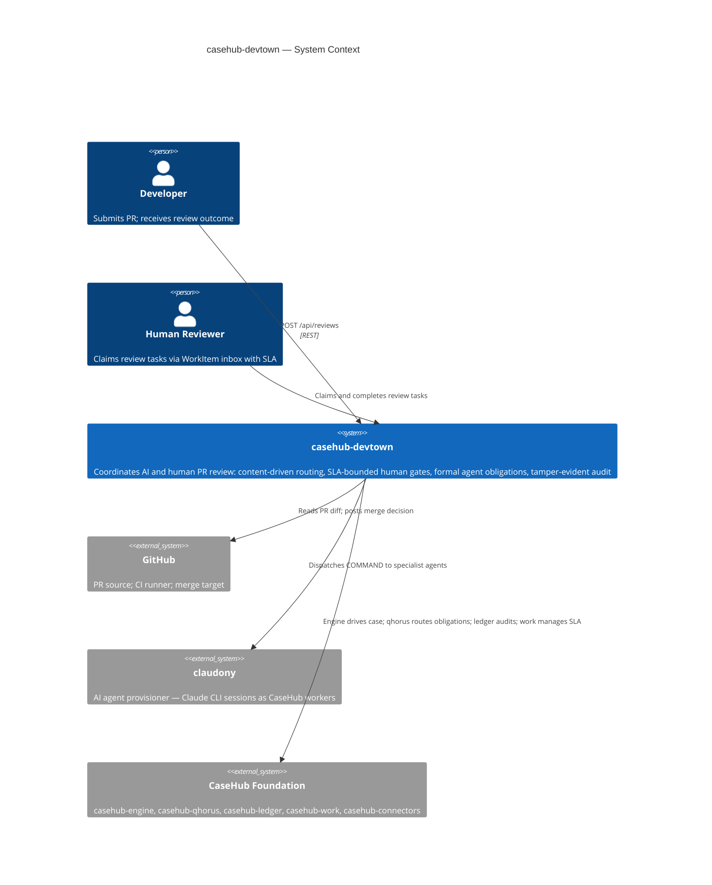
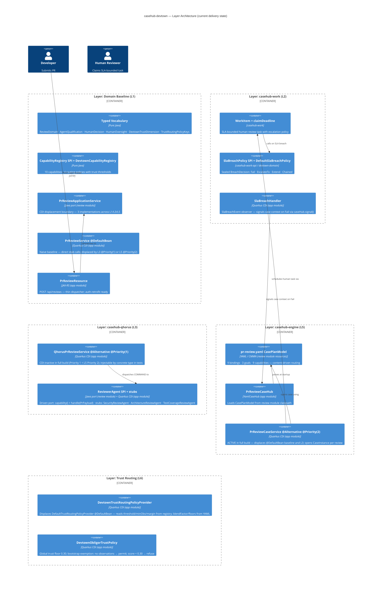
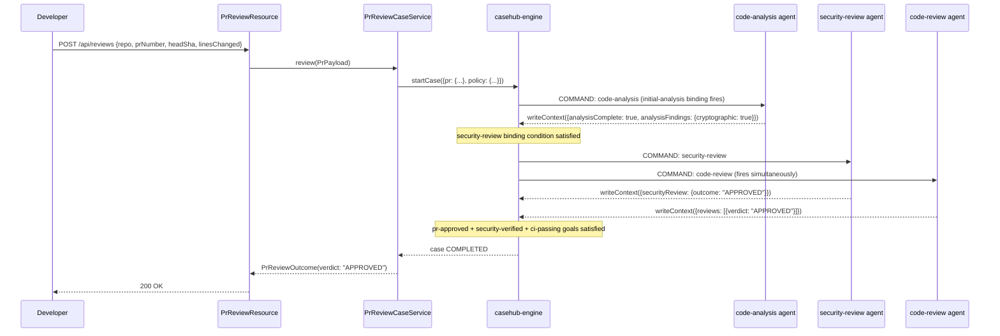
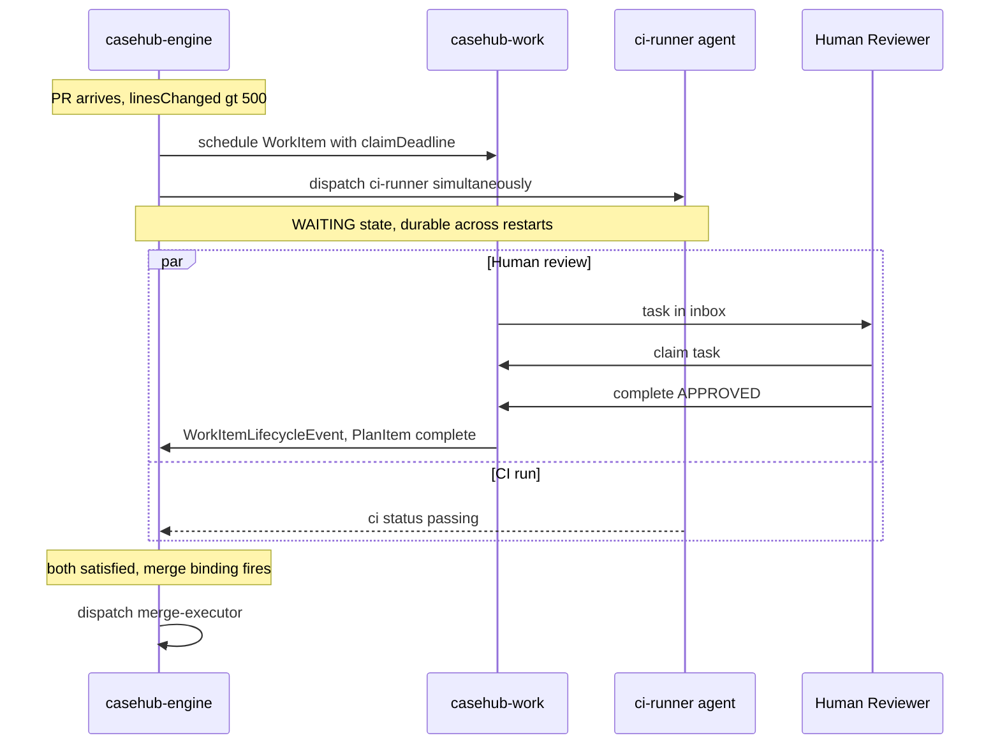
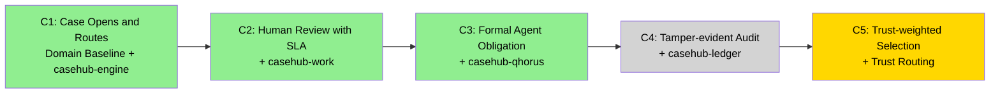
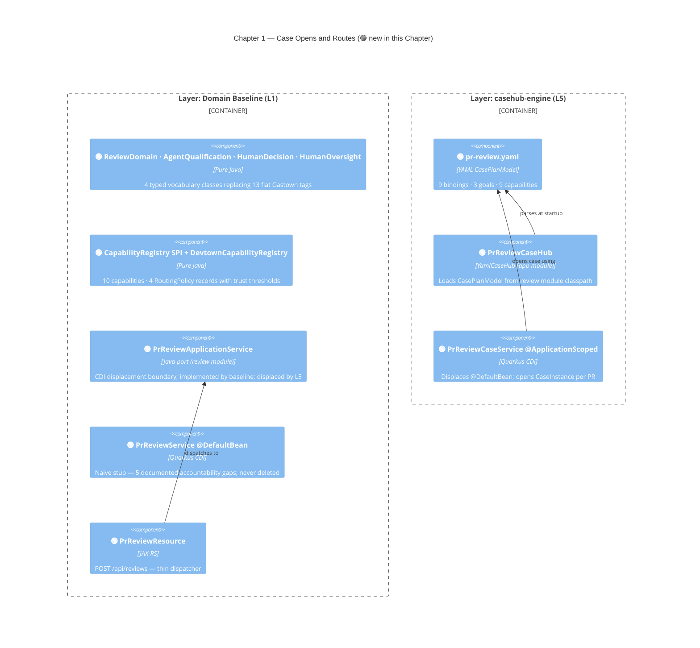
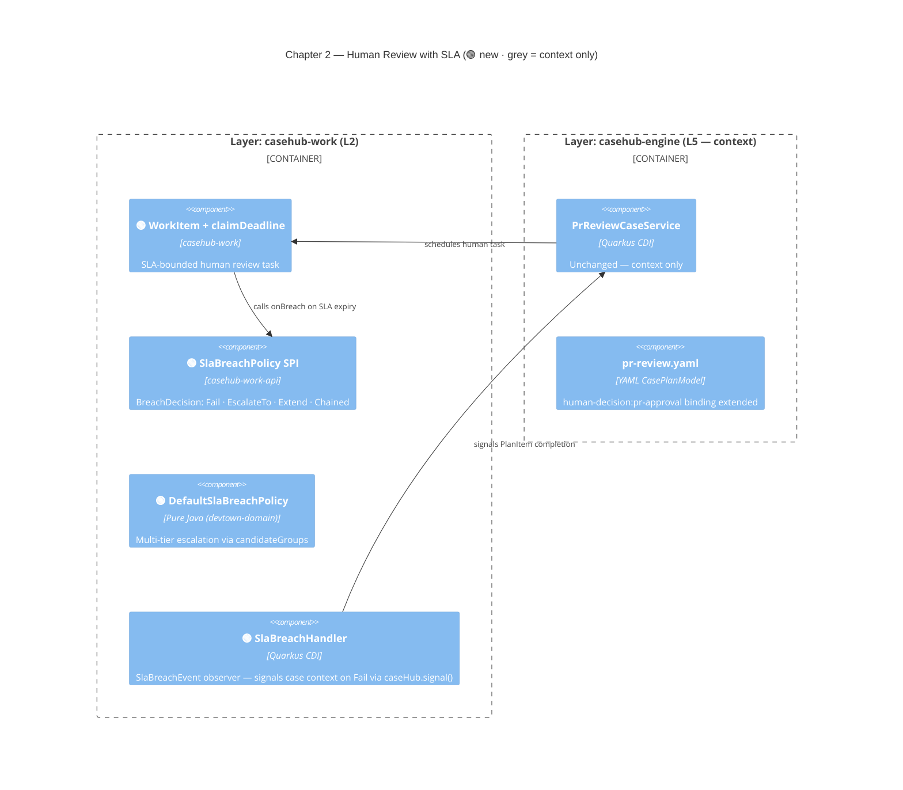

# casehub-devtown — ARC42STORIES.MD

**Version:** 0.1 (initial generation)
**Date:** 2026-05-28
**Profile:** [Arc42Stories CaseHub Profile](../parent/docs/arc42stories-casehub-profile.md)
**Spec:** [Arc42Stories Specification](../parent/docs/arc42stories-spec.md)
**Status:** Layers 1, 2 (partial), 5 complete. Layers 3, 4, 6 and Chapters 3–5 pending.

---

## §1 Introduction and Goals

### Description

`casehub-devtown` is an **agentic harness for software engineering coordination** built on the CaseHub platform foundation. It coordinates specialist code reviewers, human review task gates with SLA, and adaptive PR routing based on code content — producing a tamper-evident review record where every missed finding is traceable.

It is the reference application for the CaseHub platform: the first domain application built on top of casehub-engine, casehub-qhorus, casehub-ledger, casehub-work, and casehub-connectors. It validates the layered architecture for all future domain applications (healthcare, legal, financial compliance, etc.).

The architectural documentation serves two purposes beyond the system itself. First, **understanding** — how the layers integrate and how the parts come together, which is necessary for humans and LLMs to refactor, extend, improve, and fix the system confidently. Second, **cross-domain reuse** — not cloning this domain, but using the architectural patterns (layer integration sequence, CDI displacement, content-driven binding conditions) as a structural template for new domain implementations in AML, clinical, or any other field.

The foundation has **no domain knowledge**. It knows about cases, bindings, workers, commitments, trust, and audit. devtown provides the software engineering domain logic on top of those primitives: what a PR review is, what a merge queue does, what capabilities are required, how trust accumulates from review outcomes.

**Primary audience:** Java developers in software engineering and DevOps — a reference architecture showing what CaseHub makes possible in a domain every developer knows from daily practice. Production-grade; potential for community adoption as a real PR review coordination system.

### Stakeholders

| Stakeholder | Interest |
|---|---|
| Developer | Submits PR; receives routing decision and review outcome |
| Human Reviewer | Claims review tasks; expected to meet SLA |
| AI Agent (Claudony) | Executes specialist analysis (security, architecture, style) |
| Platform Team | Validates CaseHub foundation correctness; observes layer integration |
| Architect / Developer | Understands the reference architecture to evaluate or replicate it in their domain |

### Quality Goals

| Priority | Goal | Scenario |
|---|---|---|
| 1 | Tamper-evident audit | Every PR review decision traceable to the specific review analysis that allowed or blocked it |
| 2 | SLA-bounded human review | A reviewer missing their deadline triggers automatic escalation, not indefinite stall |
| 3 | Content-driven routing | Security review fires only when analysis finds security-sensitive code — not from author labels |
| 4 | Formal DECLINE | A specialist that cannot review the PR declares it structurally, enabling immediate re-route |
| 5 | Trust-weighted assignment | Repeated high-quality outcomes earn routing priority; poor outcomes reduce it |

### Artifact Schema

| Artifact type | Format | Example | Where it lives |
|---|---|---|---|
| Improvement log entry | `DT-NNN` | `DT-042` | `docs/PROGRESS.md` |
| Issue | `#NNN` or `casehubio/devtown#NNN` | `#52`, `casehubio/devtown#52` | GitHub Issues |
| Garden entry | `GE-YYYYMMDD-XXXXXX` | `GE-20260521-e39ad1` | `~/.hortora/garden/` |
| Protocol | `PP-YYYYMMDD-XXXXXX` | `PP-20260522-f08b62` | `casehub-parent/docs/protocols/` |
| ADR | `ADR-NNNN` | `ADR-0007` | `docs/adr/` (project repo) |
| Blog entry | `YYYY-MM-DD-[initials]NN-title` | `2026-05-19-mdp01-layer-5-lands` | workspace `blog/` |
| Design spec | `YYYY-MM-DD-topic-design` | `2026-05-15-epic3-design` | `docs/specs/` (project repo) |

---

## §2 Constraints

### Platform

| Constraint | Value | Rationale |
|---|---|---|
| Java version | Java 21 (on Java 26 JVM) | Java 21 language features; JVM 26 for performance |
| Framework | Quarkus 3.32.2 | Ecosystem-wide version lock; bump all projects together |
| Native target | GraalVM 25 | Production native image target |
| Build tool | Maven (not `./mvnw`) | Wrapper not configured; use system `mvn` |

```bash
JAVA_HOME=$(/usr/libexec/java_home -v 26) mvn clean install
```

### Architectural

- **Production-first constraint:** Before writing any class, apply: "Would this class exist in a production system that does not include any other Chapters?" If no — do not build it. See `../parent/docs/AGENTIC-HARNESS-GUIDE.md §Anti-patterns`.
- **Layering rule:** If a capability requires knowledge of software engineering concepts (PRs, commits, CI, code review, merge queues, GitHub), it belongs here. If it is purely about actors, trust, commitments, cases, or audit records, it belongs in the foundation.
- **Three-tier module structure:** `devtown-domain` (pure Java, zero framework) / `devtown-review` (integration logic, casehub-work/engine deps) / `devtown-app` (all CDI wiring). Protocol: `module-tier-structure.md`.

### Dependencies

All casehubio artifacts are `0.2-SNAPSHOT` resolved from GitHub Packages. The `casehub-parent` BOM owns version alignment. devtown may not commit to peer repo directories (`../ledger`, `../work`, etc.) — each has its own Claude session.

---

## §3 Context and Scope



### Boundary Rules

**devtown owns:** PR review vocabulary and routing policies; specialist capability definitions; trust thresholds for software engineering; the PR review CasePlanModel; merge queue orchestration (planned); cross-repo coordination cases (planned).

**Foundation owns:** case lifecycle (engine); agent communication mesh and obligation tracking (qhorus); Merkle audit chain and trust scoring (ledger); human task lifecycle and SLA (work); outbound message delivery (connectors).

See `../parent/docs/PLATFORM.md` Capability Ownership table for the full boundary map.

---

## §4 Solution Strategy

### Core Architectural Patterns

CaseHub uses a deliberate blend per tier — see `../parent/docs/ARCHITECTURE.md` for full pattern definitions and invariants.

| Tier | Pattern blend | Devtown expression |
|---|---|---|
| Domain | **Clean + Hexagonal** | `devtown-domain` is pure Java; ports in `devtown-review`; adapters in `devtown-app` |
| Orchestration | **DDD + Event-Driven + CQRS-lite** | `PrReviewCaseService` starts a CaseInstance; engine fires binding events; WAITING state for parallel human+CI |
| Application | **Hexagonal + Vertical Slices** | Each vertical slice (S1–S5) is a user-visible capability cutting through required layers |
| Cross-cutting | **Strategy + Registry + Observer** | `WorkerSelectionStrategy`, `CapabilityRegistry`, `@ObservesAsync` for ledger capture |

### Layer Taxonomy

CaseHub harness applications integrate foundation modules in a defined progression. Each layer adds one foundation module. Devtown follows the CaseHub Profile taxonomy:

| Layer | Foundation module | Reading order | Build status |
|---|---|---|---|
| Domain Baseline | *(none — pure Java)* | L1 | ✅ complete |
| casehub-work | `casehub-work` | L2 | ✅ code complete |
| casehub-qhorus | `casehub-qhorus` | L3 | ✅ complete |
| casehub-ledger | `casehub-ledger` | L4 | 🔲 pending |
| casehub-engine | `casehub-engine` | L5 | ✅ complete |
| Trust routing | `casehub-ledger` (trust APIs) | L6 | 🚧 in progress |

**Note on teaching order vs build order:** Layer 5 (casehub-engine) was built before Layers 2–4 because the CasePlanModel adaptive routing was the architectural priority. The layer ordering above is the *reading* order — the sequence a developer follows to understand how the system was assembled. LAYER-LOG.md entries follow reading order; build order is reflected in the blog entries.

### `@DefaultBean` CDI Displacement — the Teaching Pattern

Devtown's progressive layer integration is mechanised through CDI displacement:

```java
// Layer 1: always present, never deleted
@ApplicationScoped
@DefaultBean  // displaced by any @ApplicationScoped impl without @DefaultBean
public class PrReviewService implements PrReviewApplicationService { ... }

// Layer 5: displaces the above — no explicit CDI configuration required
@ApplicationScoped  // no @DefaultBean
public class PrReviewCaseService implements PrReviewApplicationService { ... }
```

Each layer adds an `@ApplicationScoped` implementation in `devtown-review`. CDI priority rules mean the newer implementation wins; the baseline remains in the build but is inactive. No code is deleted across layers. This means each layer is a coherent, deployable state — remove higher-layer JARs and the previous layer's service takes over. No code is deleted; the baseline remains a legitimate fallback in production.

### Chapter Sequencing Rationale (summary — full rationale in §9.2)

- **C1 before C2:** engine runtime (L5) established in C1; casehub-work-adapter chains onto engine events at runtime
- **C2 before C3:** SLA-bounded human gate must exist before formal per-agent obligation tracking is meaningful
- **C3 before C4:** qhorus messaging generates the MessageLedgerEntry chain that makes C4's tamper-evident audit meaningful
- **C4 before C5:** trust scoring reads attestation data written by the ledger — hard runtime dependency

---

## §5 Building Block View

### Layer Architecture View

Current delivery state — Layers 1, 2, 3, 5, 6. Layer 4 (casehub-ledger) added when Chapter C4 ships.



### Three-Tier Module Structure

```
devtown-domain/   — pure Java; zero Quarkus, zero JPA
  domain/         vocabulary types + CapabilityRegistry SPI + default impl + RoutingPolicy
  (no CDI, no @ApplicationScoped)

devtown-review/   — integration logic; casehub-engine-api, casehub-work-api deps
  review/         PrReviewApplicationService port + DTOs (PrPayload, PrReviewOutcome)
                  Layer N implementations of the port (one per layer)
                  pr-review.yaml CasePlanModel in resources/devtown/
                  Binding condition unit tests (no Quarkus required)

devtown-app/      — CDI wiring only; runtime assembly
  app/            CapabilityRegistryBean (one-liner CDI wrapper)
                  PrReviewService @DefaultBean (Layer 1 naive)
                  PrReviewCaseHub + PrReviewCaseService (Layer 5)
                  PrReviewResource (REST adapter)
                  SPI subclasses for engine/ledger persistence
```

---

## §6 Runtime View

### Scenario 1 — Content-Driven Security Review Routing

When analysis finds security-sensitive code, the security-review binding fires automatically. When it does not, the case routes directly to standard review. The routing decision is in the YAML, not in author labels.



### Scenario 2 — Parallel Human Approval and CI

Human review and CI run simultaneously. Total time is `max(human, CI)` not their sum. If CI fails while human is reviewing, a cancel binding fires automatically.



---

## §7 Deployment View

```
Developer machine / CI:
  JAVA_HOME=$(/usr/libexec/java_home -v 26) mvn clean install
  → devtown-domain.jar + devtown-review.jar + devtown-app-runner.jar

Production target:
  GraalVM 25 native image (devtown-app)
  Datasource: PostgreSQL (production); H2 MODE=PostgreSQL (test)
  Flyway migrations: V1–V999 devtown domain; V2000+ ledger subclass join tables

GitHub Packages:
  All casehubio/* artifacts at 0.2-SNAPSHOT
  Resolved via: <url>https://maven.pkg.github.com/casehubio/*</url>
  CI authentication: server-id: github + GITHUB_TOKEN
```

**Known gap:** `quarkus:build` (production packaging) fails without claudony + persistence modules present — foundation CDI SPIs are unsatisfied standalone. All 100+ tests pass. Tracked: devtown#31.

---

## §8 Crosscutting Concepts

References to governing protocols rather than duplicating their content:

| Concern | Protocol / Reference |
|---|---|
| Module tier structure (domain / review / app) | `docs/protocols/universal/module-tier-structure.md` |
| Flyway migration naming and H2 compatibility | `docs/protocols/universal/flyway-migration-rules.md` |
| CDI displacement (`@DefaultBean`) | `docs/protocols/casehub/alternative-extension-patterns.md` |
| SPI placement (which module owns the port) | `docs/PLATFORM.md §Step 4` |
| Named datasources | `docs/PLATFORM.md §Persistence` |
| Architectural patterns (Hexagonal, Clean, DDD, Event-Driven) | `../parent/docs/ARCHITECTURE.md` |
| Capability ownership boundaries | `docs/PLATFORM.md` Capability Ownership table |
| Vertical slice planning | `docs/protocols/universal/vertical-slice-planning.md` |
| Private exceptions and `@Transactional` boundaries | `PP-20260522-f08b62` |
| SPI testing without Mockito | `docs/protocols/universal/spi-testing-alternative-inner-classes.md` |
| `@QuarkusTest` database setup | `docs/protocols/universal/quarkus-test-database.md` |

### Anti-patterns

These have either occurred in devtown or are the most likely mistakes when extending it. All three are symptoms of the same root cause: trying to make multiple layer implementations coexist in one deployment rather than using CDI displacement correctly.

- **CDI priority gymnastics to force layer coexistence**
  - Symptom: `AmbiguousResolutionException` when two `@ApplicationScoped` implementations of `PrReviewApplicationService` exist; resolved by adding `@Alternative @Priority(N)` to one
  - Cause: the new layer implementation wasn't intended to displace the previous one — both were meant to be "present." This is not a production state.
  - Fix: only one non-`@DefaultBean` implementation of a port interface belongs in production at any layer. The `@DefaultBean` baseline is the fallback; one `@ApplicationScoped` without `@DefaultBean` displaces it. Remove the `@Alternative @Priority` and decide which implementation is active.

- **`@Unremovable` to keep a dormant layer bean alive**
  - Symptom: Quarkus bean removal eliminates a layer implementation because nothing injects it in the current build; `@Unremovable` added to suppress the warning
  - Cause: the bean exists only because a previous layer's implementation is still in the build. Quarkus is correctly signalling it has no production role.
  - Fix: if Quarkus wants to remove a bean, that is the right signal. The `@DefaultBean` displacement pattern means earlier layer implementations stay in the build but are legitimately superseded — they do not need `@Unremovable`.

- **A new port implementation without displacing the previous one**
  - Symptom: two non-`@DefaultBean @ApplicationScoped` implementations of `PrReviewApplicationService` in the same deployment
  - Cause: a new layer implementation was added without recognising that the previous layer's implementation (which had already displaced the `@DefaultBean` baseline) is still active
  - Fix: audit the CDI displacement chain before adding any new port implementation. At any given layer, exactly one non-`@DefaultBean` implementation should be active. The chain is: `@DefaultBean` baseline (L1) ← displaced by first `@ApplicationScoped` impl (L5 currently). Adding L3's impl means L5's must be removed or the new one must be the sole active implementation.

### Security

REST layer: `@RolesAllowed` can be added to `PrReviewResource.review()` without structural change — auth-retrofit ready by design.

### Observability

`CaseLedgerEntry` records every case state transition. `MessageLedgerEntry` records every qhorus message. Both are append-only and hash-chained (Merkle frontier). Audit trail is the primary observability mechanism for correctness; Micrometer metrics for performance.

### Error Handling

Failure is a fact on the blackboard. Binding conditions evaluate against failure facts and route differently by failure type: `DECLINED` (capability mismatch → immediate re-route); `FAILED` (technical failure → try backup, then escalate); `EXPIRED` (stall → systemic investigation). Protocol PP-20260522-f08b62 governs `@Transactional` loop boundaries.

---

## §9 Journeys and Chapters

### §9.1 Journey Overview

| Journey | Description | Chapters | Status |
|---|---|---|---|
| PR Review Coordination | A submitted pull request is reviewed by specialist agents with formal accountability, human oversight with SLA, and a tamper-evident audit trail that traces any production incident back to the review decision that allowed it | 5 | In progress (C1, C2 complete) |

### §9.2 Chapter Index



| # | Chapter | Journey | Layers touched | Delta | Status |
|---|---|---|---|---|---|
| 1 | Case opens and routes | PR Review Coordination | L1, L5 | High, High | ✅ complete |
| 2 | Human review with SLA | PR Review Coordination | + L2 | Medium | ✅ complete |
| 3 | Formal agent obligation | PR Review Coordination | + L3 | Low | ✅ complete |
| 4 | Tamper-evident audit | PR Review Coordination | + L4 | Medium | 🔲 pending |
| 5 | Trust-weighted selection | PR Review Coordination | + L6 | Medium | 🚧 in progress |

**Layer × Chapter matrix**

| Layer | C1 ✅ | C2 ✅ | C3 ✅ | C4 🔲 | C5 🚧 |
|---|---|---|---|---|---|
| L1 Domain Baseline | High | Low | — | — | — |
| L2 casehub-work | — | Medium | Low | Low | Low |
| L3 casehub-qhorus | — | — | Low | — | — |
| L4 casehub-ledger | — | — | — | Medium | Low |
| L5 casehub-engine | High | Low | Low | Low | Low |
| L6 Trust Routing | — | — | — | — | Medium |

L5 participates in every Chapter — it is the foundational orchestration layer. L1 carries a High delta in C1 only; subsequent Chapters make lightweight extensions. L3 and L6 are additive: each appears in one Chapter at Low/Medium and is stable thereafter.

**Sequencing rationale:**
- C1 before C2: L5 engine runtime established in C1; `casehub-work-adapter` depends on engine events at runtime
- C2 before C3: SLA-bounded human gate must exist before formal per-agent obligation tracking is meaningful
- C3 before C4: qhorus messaging generates the `MessageLedgerEntry` chain that makes C4's tamper-evident audit meaningful
- C4 before C5: trust scoring reads `LedgerAttestation` records written by L4 — hard runtime dependency
- L5 built before L2–L4 in actual delivery sequence (engine was the architectural priority): Chapter ordering is the reading order, not build order

---

### §9.3 Chapter Entries

---

#### Chapter 1 — Case Opens and Routes

**Journey:** PR Review Coordination | **Sequence:** 1 of 5 | **Status:** ✅ complete
**Delivered:** 2026-05-19 | **Issues:** casehubio/devtown#8, #9, #27, #10 | **Blog:** `blog/2026-05-11-mdp01-the-vocabulary-problem.md`; `blog/2026-05-19-mdp01-layer-5-case-definition-lands.md`

**What this delivers**
A developer submits a PR and receives a review outcome driven by what the code actually contains — security review fires only when analysis finds cryptographic or authentication code, and cannot be bypassed by omitting labels. The full stack is exercised from a single `POST /api/reviews` call. Trust weighting uses bootstrap mode (availability routing) until sufficient attestations accumulate.

**Accountability gaps closed**
- No attribution (which agent ran this analysis?) → L5 `CaseLedgerEntry` per binding dispatch
- No formal DECLINE → L5 DECLINED outcome on blackboard triggers re-routing
- No content-driven routing → L5 security binding fires on analysis findings, not author labels

**Layer Impact**
| Layer | Delta |
|---|---|
| L1 Domain Baseline | High — typed vocabulary, port interface, naive baseline service, REST entry point |
| L5 casehub-engine | High — `pr-review.yaml` CasePlanModel, `PrReviewCaseHub`, `PrReviewCaseService` displaces baseline |

*C1 spans two layers — the C4 view below shows their cross-layer relationship.*



---

#### Chapter 2 — Human Review with SLA

**Journey:** PR Review Coordination | **Sequence:** 2 of 5 | **Status:** ✅ complete (code and documentation); failure goal pending
**Delivered:** 2026-05-23 | **Issues:** casehubio/devtown#41, #42 | **Blog:** no dedicated entry

**What this delivers**
Human review assignments are now SLA-bounded — a reviewer who misses their deadline triggers automatic escalation (to a senior reviewer, extended deadline, or failure) rather than indefinite stall. Review accountability tracks per individual, not per group. Caveat: breach-triggered case failure requires engine#326 to close fully.

**Accountability gaps closed**
- No response SLA → `WorkItem.claimDeadline` + `SlaBreachPolicy`
- No formal human task lifecycle → `WorkItem` claim → individual assignment → completion record

**Layer Impact**
| Layer | Delta |
|---|---|
| L1 Domain Baseline | Low — `DefaultSlaBreachPolicy` added to `devtown-domain` |
| L2 casehub-work | Medium — `WorkItem`, `SlaBreachPolicy SPI`, `BreachDecision` sealed interface, `SlaBreachPolicyBean`, `SlaBreachHandler` |
| L5 casehub-engine | Low — `HumanTaskTarget` wiring in `pr-review.yaml` |

*C2 diagram retained — the L2↔L5 bridge (`WorkItemLifecycleEvent → PlanItem`) is the cross-layer interaction this Chapter introduces.*



---

#### Chapter 3 — Formal Agent Obligation

**Journey:** PR Review Coordination | **Sequence:** 3 of 5 | **Status:** ✅ complete
**Delivered:** 2026-05-29 | **Issues:** casehubio/devtown#52 | **Blog:** `blog/2026-05-29-mdp02-layer3-obligation-explicit.md`

**What this delivers**
Every specialist review assignment is now a formal speech act. COMMAND creates a tracked Commitment for the agent; DONE discharges it with findings recorded; DECLINE is a typed scope refusal with a reason — not a timeout, not a silent failure. Every inter-agent message is recorded as a `MessageLedgerEntry`, establishing the audit chain that makes Layer 4's tamper-evident record meaningful.

**Accountability gaps closed**
- No formal obligation per reviewer → L3 COMMAND creates a Commitment; DONE/DECLINE discharge it
- No formal scope refusal → L3 DECLINE is a typed outcome with recorded reason
- No audit of inter-agent communication → L3 `MessageLedgerEntry` per speech act

**Layer Impact**
| Layer | Delta |
|---|---|
| L3 casehub-qhorus | Low — `QhorusPrReviewService`, `ReviewerAgent` port, 3 stub agents, 5 lifecycle tests |
| L5 casehub-engine | Low — `PrReviewCaseService` bumped to `@Alternative @Priority(2)` for CDI coexistence with L3 |

---

#### Chapter 4 — Tamper-evident Audit

**Journey:** PR Review Coordination
**Sequence:** 4 of 5
**Status:** 🔲 pending (Layer 4 not yet started)

🔲 Full Chapter entry at C4 close. Blocked on Layer 4 (casehub-ledger) implementation. Requires C3 first — ledger entries are meaningful only when qhorus commitment chain generates `MessageLedgerEntry` records.

Known scope: `CaseLedgerEntry` per case state transition; production incident traceable to review decision via `causedByEntryId` chain; EU AI Act Art.12 compliance.

---

#### Chapter 5 — Trust-weighted Selection

**Journey:** PR Review Coordination | **Sequence:** 5 of 5 | **Status:** 🚧 in progress
**Issues:** casehubio/devtown#57, casehubio/devtown#58, casehubio/devtown#62 | **Blog:** `blog/2026-05-31-mdp01-layer6-trust-routing.md`

**What this delivers (partial — routing infrastructure wired; attestation accumulation pending Layer 4)**
Trust-weighted reviewer assignment is now active infrastructure: `TrustWeightedAgentStrategy` activates by classpath presence and displaces `LeastLoadedAgentStrategy`; `DevtownTrustRoutingPolicyProvider` supplies per-capability thresholds, blend factors, and quality floors from registry + YAML. A global trust floor of 0.30 with bootstrap exemption (`DevtownObligorTrustPolicy`) prevents unqualified agents from taking assignments once trust history exists. All agents remain in Phase 0 (BOOTSTRAP) — routing is availability-based until Layer 4 wires the attestation trail.

**Accountability gaps closed (partial)**
- No trust weighting (Layer 1 gap) → L6 `TrustWeightedAgentStrategy` wired; Phase 1+ trust routing activates automatically as `WorkerDecisionEntry` attestations accumulate (L4 dependency for the write path)

**Open**
- casehubio/devtown#62 — merge-executor bootstrap path to `HumanOversight` when no agent meets `minimumObservations`; trust gate cannot address this structurally (BOOTSTRAP agents are exempt by design)

**Layer Impact**
| Layer | Delta |
|---|---|
| L6 Trust Routing | Medium — `DevtownTrustRoutingPolicyProvider`, `trust-routing.yaml`, `DevtownObligorTrustPolicy`, 35 tests |
| L1 Domain Baseline | Low — `TrustRoutingPolicyKeys` added; `DevtownTrustDimension.PRECISION` rename |

---

### §9.4 Layer Entries

---

### Layer — Domain Baseline

**Participates in chapters:** C1, C2, C3, C4, C5
**Architectural patterns:** Clean (dependency rule — pure Java domain, zero framework imports); Hexagonal (`PrReviewApplicationService` port; adapters in `devtown-app`)
**Key protocols:** `module-tier-structure.md` (three-tier: domain / review / app); `alternative-extension-patterns.md` (@DefaultBean displacement)
**Design refs:** `docs/specs/2026-05-15-layer1-partb-naive-service-design.md`; `docs/specs/2026-05-07-epic1-scaffold-design.md`; `docs/specs/2026-05-08-epic2-domain-model-design.md`; `docs/gastown-casehub-analysis-v2.md §DT-001` (vocabulary split rationale)
**Issues:** casehubio/devtown#8 (Epic 1 scaffold), casehubio/devtown#9 (Epic 2 vocabulary), casehubio/devtown#27 (Part B — baseline service)
**Navigation:** `git log --grep="#27" --oneline`
**Blog:** `blog/2026-05-11-mdp01-the-vocabulary-problem.md`
**Improvement refs:** `docs/PROGRESS.md` DT-001 through DT-006
**Completed:** Epic 1: 2026-05-08 `10d0d42`; Epic 2: 2026-05-11 `ccbe944`; Part B: 2026-05-15 `cca6acc` + `18b22e0`

#### What it adds

Layer 1 has two distinct parts. The first (Epics 1–2) establishes the devtown vocabulary — a typed split of what Gastown keeps in a flat namespace. The second (Epic 3 Part B) shows the domain baseline: direct service calls with no accountability, no SLA, no formal obligation. Together they form the baseline everything else improves upon.

**Part A — Vocabulary and scaffold (Epics 1–2)**

The domain model is pure Java, no CaseHub dependencies. The vocabulary split is devtown's first and most impactful architectural decision: Gastown's 13 flat capability tags become four typed classes with distinct routing semantics. `security-review` is analytical (trust-scored on quality). `ci-runner` is operational (trust-scored on outcome). `human-decision:pr-approval` is a formal accountability event (WorkItem lifecycle). `human-oversight:routing-review` is system-level oversight (triggered by routing uncertainty). These four categories route through different foundation infrastructure — conflating them in a flat namespace loses the semantic distinction before the foundation ever sees it. See DT-001 through DT-006 in `docs/PROGRESS.md`.

**Part B — Baseline PR review service**

`PrReviewService @DefaultBean` makes direct stub calls via private methods. The five accountability gaps are documented in this LAYER-LOG (not as code comments) — they are the comparison baseline that each subsequent layer closes. `PrReviewResource` exposes `POST /api/reviews` so the layer is runnable from a single HTTP call. `PrPayload` and `PrReviewOutcome` are defined as records in `devtown-review` — not `devtown-app`.

#### Accountability gaps closed

None closed by L1 — this layer *establishes* the gaps that subsequent layers close.

| Gap established | What breaks | Closed by |
|---|---|---|
| No attribution | Which agent ran this analysis? No record. | Layer 5 (`CaseLedgerEntry` per binding dispatch) |
| No response SLA | Analysis stalls indefinitely with no escalation | Layer 2 (`WorkItem.claimDeadline`) |
| No formal DECLINE | Specialist outside capability silently fails or errors | Layer 5 (DECLINED outcome on blackboard) |
| No tamper-evident audit | Cannot trace production incident to review decision | Layer 4 (`CaseLedgerEntry.causedByEntryId` chain) |
| No trust weighting | Novice and expert are treated identically | Layer 6 (`TrustWeightedSelectionStrategy`) |

#### Key files

- `domain/src/main/java/io/casehub/devtown/domain/ReviewDomain.java` — 6 analytical review capability constants
- `domain/src/main/java/io/casehub/devtown/domain/AgentQualification.java` — 2 execution capability constants
- `domain/src/main/java/io/casehub/devtown/domain/HumanDecision.java` — formal PR accountability event constant
- `domain/src/main/java/io/casehub/devtown/domain/HumanOversight.java` — routing uncertainty constant
- `domain/src/main/java/io/casehub/devtown/domain/DevtownTrustDimension.java` — 3 quality dimension constants (`review-thoroughness`, `precision`, `scope-calibration`); `false-positive-rate` renamed to `precision` in devtown#57
- `domain/src/main/java/io/casehub/devtown/domain/RoutingPolicy.java` — configurable routing policy record with `isBootstrap()` and `isBorderline()`
- `domain/src/main/java/io/casehub/devtown/domain/DevtownCapabilityRegistry.java` — populated default implementation; 10 capabilities, 4 routing policies
- `domain/src/main/java/io/casehub/devtown/domain/spi/CapabilityRegistry.java` — SPI: `capabilities()`, `policy()`, `isKnown()` default method
- `app/src/main/java/io/casehub/devtown/app/CapabilityRegistryBean.java` — `@ApplicationScoped` CDI wrapper, zero logic
- `review/src/main/java/io/casehub/devtown/review/PrReviewApplicationService.java` — port interface; CDI displacement boundary for Layer 2+
- `review/src/main/java/io/casehub/devtown/review/PrPayload.java` — input record: repo, prNumber, headSha, linesChanged
- `review/src/main/java/io/casehub/devtown/review/PrReviewOutcome.java` — output record: verdict, findings (`List<String>`)
- `app/src/main/java/io/casehub/devtown/app/PrReviewService.java` — `@ApplicationScoped @DefaultBean`; naive baseline; displaced by Layer 5
- `app/src/main/java/io/casehub/devtown/app/PrReviewResource.java` — thin REST dispatcher; `POST /api/reviews`
- `app/src/test/java/io/casehub/devtown/app/DevtownBootTest.java` — Quarkus boot + CDI discovery verification
- `app/src/test/java/io/casehub/devtown/app/PrReviewServiceTest.java` — plain unit tests; no Quarkus; 3 contract assertions

#### Key wiring

**Module structure — pure Java domain, Quarkus only in `devtown-app/`.**
`devtown-domain` has zero framework dependencies. All constants, SPI, and default implementation live there. `devtown-app` owns all CDI and Quarkus wiring. This split enforces the dependency rule — domain logic must be independent of the framework. If CDI annotations leak into `devtown-domain`, the clean architectural boundary breaks and the module structure no longer enforces the correct dependency direction.

**`@DefaultBean` displacement pattern.**
The baseline service carries `@DefaultBean`. Each subsequent layer adds an `@ApplicationScoped` implementation in `review/` without it — CDI displacement means the new one wins. Both classes coexist across all layers; no code is deleted.

```java
// app/PrReviewService.java — Layer 1, always present
@ApplicationScoped
@DefaultBean
public class PrReviewService implements PrReviewApplicationService { ... }

// review/PrReviewCaseService.java — Layer 5+, displaces the above
@ApplicationScoped  // no @DefaultBean — takes CDI priority
public class PrReviewCaseService implements PrReviewApplicationService { ... }
```

**Port interface in `review/`, not `app/`.**
`PrReviewApplicationService`, `PrPayload`, and `PrReviewOutcome` live in `devtown-review`. Layer 2+ implementations also live in `devtown-review` (they depend on `casehub-engine-api`, `casehub-work-api`, etc. — already in the `review` pom). If the port lived in `app/`, any `review`-module implementation would need to depend on `app`, creating a module dependency cycle. Caught in code review; fixed in `18b22e0`.

**`CapabilityRegistry` SPI as vocabulary/registry SPI, not no-op.**
Platform protocol distinguishes operational no-op SPIs (empty default) from vocabulary/registry SPIs (populated default). `DevtownCapabilityRegistry` is the latter — the default is a fully populated implementation. `CapabilityRegistryBean` is a one-liner `@ApplicationScoped` subclass that promotes it to CDI without any logic duplication.

**`isKnown()` as a `default` method on the SPI interface.**
Initially written as a concrete method in `DevtownCapabilityRegistry` calling the backing static field directly — not virtual. Commit `ad75f20` fixed it to call `capabilities()` in the implementation; commit `8b3305e` promoted it to a `default` method on the SPI interface. Any subclass overriding `capabilities()` gets a correct `isKnown()` for free.

**Vocabulary split rationale.**
13 flat Gastown tags → 4 typed classes. The split emerged from recognising that `security-review`, `batch-bisect`, and `notify` are not the same kind of thing and should not route through the same trust infrastructure. `BATCH_BISECT`, `COORDINATED_MERGE`, and `COORDINATED_ROLLBACK` are orchestration operations — expressed as CasePlanModel binding structures (Epics 4/5), not trust-scored capability strings. `NOTIFY` is a connector call, not a trust-scored capability. Full rationale: `docs/gastown-casehub-analysis-v2.md §DT-001`; blog `2026-05-11-mdp01-the-vocabulary-problem.md`.

#### Architectural decisions

**Why typed classes over a flat namespace:** See §Key wiring Vocabulary split rationale. The payoff is downstream — when `TrustGateService`, `ActorType`, and `WorkerSelectionStrategy` are wired, the vocabulary is the application-layer expression of what those foundation capabilities can express. The split at Layer 1 prevents type confusion at Layer 5 and beyond.

**Why `RoutingPolicy` values at Layer 1, not Layer 6:** Routing thresholds are domain knowledge — `security-review` at 0.70 reflects a decision that security mistakes reach production. Recording this at domain definition time (Layer 1) rather than framework wiring time (Layer 6) keeps the threshold visible and reviewable independent of the trust infrastructure.

#### Pattern introduced

**`@DefaultBean` CDI displacement** — each layer adds a higher-priority `@ApplicationScoped` implementation in `devtown-review` that displaces the baseline without deleting it. The baseline remains in the build across all layers.

#### Pattern anchor

`app/PrReviewService.java` (`@DefaultBean` baseline) + `review/PrReviewApplicationService.java` (port that controls the displacement boundary).

#### Gotchas

- **`isKnown()` returns wrong results on a subclass**
  - Symptom: `CapabilityRegistry` subclass that overrides `capabilities()` returns incorrect results from `isKnown()`
  - Cause: initial implementation called the backing static field directly, bypassing the virtual `capabilities()` method
  - Fix: `isKnown()` promoted to a `default` method on the SPI interface calling `capabilities()` (`8b3305e`). Write a test for `isKnown()` on a subclass that overrides `capabilities()` before adding the first subclass.

- **Adding `NOTIFY` to the vocabulary causes nonsensical trust threshold checks**
  - Symptom: `TrustGateService.meetsThreshold()` called with a notification capability tag; no trust-scored actor exists
  - Cause: `NOTIFY` looks like a capability but is a connector call — it has no quality dimension
  - Fix: call `casehub-connectors` directly from the case plan model; remove from vocabulary

- **Port interface placed in `app/` causes a module dependency cycle in Layer 2**
  - Symptom: `review`-module implementation cannot compile — `review` would need to depend on `app` to access the interface
  - Cause: `app` is the runtime assembly; it consumes SPIs, it doesn't define them
  - Fix: move port interface and DTOs to `review` module (`18b22e0`)

- **On day 1, trust-based routing appears identical to Gastown**
  - Symptom: routing assigns work without apparent trust weighting; `RoutingPolicy` thresholds seem to have no effect
  - Cause: all agents are in bootstrap mode (`isBootstrap()` returns true) because `minimumObservations` hasn't been reached. This is correct — a trust score from 2–3 attestations is noise, not signal.
  - Fix: no fix required; this is the Phase 0 maturity model by design. See DT-006 in `docs/PROGRESS.md`.

#### Pattern to replicate

1. Create `{domain}-domain` Maven module — zero framework imports, zero JPA, no Quarkus
2. Identify your domain's work types. Ask: are they analytical (trust-scored on quality), operational (trust-scored on outcome), human decisions (with SLA and lifecycle), or system-oversight (triggered by uncertainty)? Create a typed class per category — not a flat string list
3. Define `RoutingPolicy` values for trust-sensitive capabilities: `threshold` (minimum trust), `minimumObservations` (credibility gate), `borderlineMargin` (uncertainty band → human oversight), `fallbackType`, and `rationale`
4. Implement `CapabilityRegistry` SPI in `{domain}.spi` — `capabilities()`, `policy()`, `isKnown()` as default method calling `capabilities()`
5. Implement the populated default registry in `{domain}` — concrete class, no CDI
6. Create `{domain}-app` Maven module — depends on `{domain}-domain`; owns all Quarkus wiring
7. Add a one-liner `@ApplicationScoped` CDI wrapper in `{domain}-app` extending your registry
8. Define port interface + DTOs in `{domain}-review` module (pure Java, no CDI, no Quarkus) — Layer 2+ implementations also live here; keeping them out of `{domain}-app` prevents a module dependency cycle
9. Implement the baseline service with `@ApplicationScoped @DefaultBean` in `{domain}-app` — direct stub calls; document accountability gaps in ARC42STORIES.MD §9.4 Layer entry
10. Expose `POST /api/{domain-noun}` via a thin REST resource in `{domain}-app` injecting the port interface — auth-retrofit ready (`@RolesAllowed` can be added to the single method without restructuring)
11. Boot test: verify CDI discovers the baseline service and REST resource
12. Unit test the baseline service: plain `new PrReviewService()`, no Quarkus — verify non-null outcome, non-blank verdict, non-null findings list

---

### Layer — casehub-work

**Participates in chapters:** C2, C3, C4, C5
**Architectural patterns:** Hexagonal (`SlaBreachPolicy` SPI; `WorkItem` as port); Event-Driven (`@ObservesAsync SlaBreachEvent`; `WorkItemLifecycleEvent → PlanItem` bridge)
**Key protocols:** `module-tier-structure.md`; `flyway-migration-rules.md` (default datasource for work tables)
**Design refs:** `DESIGN.md §Layer 2 SLA Breach Policy`; `docs/specs/2026-05-22-layer2-sla-breach-policy-design.md`
**Issues:** casehubio/devtown#41 (work adapter wiring), casehubio/devtown#42 (SLA breach handler wiring test)
**Navigation:** `git log --grep="#41" --oneline`
**Blog:** no dedicated entry — work spanned multiple sessions without a session narrative
**Improvement refs:** 🔲
**Completed:** 2026-05-23 `8ea1687` (devtown#41); wiring test `22f2410` (devtown#42). Failure goal deferred — engine#326 now closed; `pr-review.yaml` `kind: failure` goal still pending.

#### What it adds

Layer 2 adds `casehub-work` to the PR review case. The gap it closes: human review can stall indefinitely with no escalation. After Layer 2, every human review assignment is a `WorkItem` with a configurable `claimDeadline` (24h default), routed to `pr-reviewers`. When the reviewer misses the deadline, `SlaBreachPolicy` fires: escalate to `pr-leads` with a new 8h deadline; if they miss it too, fail with reason `"sla-breach"` and signal the case context.

The escalation is stateless — `DefaultSlaBreachPolicy` reads `candidateGroups` from the expired `WorkItem` to detect the current tier. No decision tree serialization; no state storage. `SlaBreachHandler` observes the `SlaBreachEvent` and calls `caseHub.signal()` on `Fail`, writing `humanApproval.status = "sla-breach"` into the case context.

**Failure goal deferred:** the `kind: failure` goal that would formally terminate the case on SLA breach requires engine#326 (now closed). `pr-review.yaml` has not yet been updated with the failure goal declaration — the case stalls correctly (merge condition is unsatisfiable) but does not produce a formal FAILED outcome. See §12 Technical Debt.

#### Accountability gaps closed

| Gap | What breaks without it | Closed by |
|---|---|---|
| No response SLA | Human reviewer misses security finding; no escalation, no record | `WorkItem.claimDeadline` + `SlaBreachPolicy` |
| No formal human task lifecycle | Review assigned to a group with no individual accountability | `WorkItem` claim → individual assignment → completion record |

#### Key files

- `domain/src/main/java/io/casehub/devtown/domain/sla/SlaPreferenceKeys.java` — typed preference keys: `CANDIDATE_GROUP` ("pr-reviewers"), `ESCALATION_GROUP` ("pr-leads"), `ESCALATION_HOURS` (8), `COMPLETION_HOURS` (24), `BREACH_TERMINAL_REASON` ("sla-breach")
- `domain/src/main/java/io/casehub/devtown/domain/sla/DefaultSlaBreachPolicy.java` — stateless two-tier escalation; reads `ctx.task().candidateGroups()` to detect current tier; escalation group present → terminal `Fail`; otherwise → `EscalateTo` with `ESCALATION_HOURS` deadline
- `domain/src/main/java/io/casehub/devtown/domain/sla/StringPreference.java` — record wrapping String with `parse()` factory; used by `SlaPreferenceKeys` for group names and reasons
- `app/src/main/java/io/casehub/devtown/app/SlaBreachPolicyBean.java` — `@ApplicationScoped extends DefaultSlaBreachPolicy`; one-liner; displaces `NoOpSlaBreachPolicy @DefaultBean` from `casehub-work`
- `app/src/main/java/io/casehub/devtown/app/SlaBreachHandler.java` — `@Observes SlaBreachEvent`; extracts `caseId` via `CallerRef.parse(event.context().task().callerRef())`; on `Fail`: `caseHub.signal(caseId, "humanApproval", Map.of("status", fail.reason()))`; on `EscalateTo`: no-op (WorkItem mutated in-place, case waits)
- `review/src/main/resources/devtown/pr-review.yaml` — `human-approval` binding extended: `candidateGroups: [pr-reviewers]`, `expiresIn: PT24H`
- `domain/src/test/java/io/casehub/devtown/domain/sla/DefaultSlaBreachPolicyTest.java` — plain JUnit, 8 tests: first breach → EscalateTo; second breach → Fail; blank escalation group → immediate Fail
- `app/src/test/java/io/casehub/devtown/app/SlaBreachHandlerWiringTest.java` — `@QuarkusTest`; `@Alternative @ApplicationScoped CapturingBreachPolicy` static inner class; verifies `ExpiryLifecycleService` injects the bean and displaces NoOp
- `app/src/test/java/io/casehub/devtown/app/SlaBreachLifecycleTest.java` — `@QuarkusTest`; full two-tier breach: start case, obtain WorkItem, set `expiresAt` to past, `expiryService.checkExpired()`, verify in-place reassignment; repeat for terminal failure

#### Key wiring

**`SlaBreachPolicy` SPI in `casehub-work-api`, not a new `platform/apps-api` module.**
Initially planned for a new cross-application SPI module. Revised: every consumer already has `casehub-work-api` on their classpath; `BreachedTask` mirrors WorkItem fields; the SPI triggers on WorkItem expiry. `platform/apps-api` is deferred until a genuinely work-independent cross-app SPI surfaces. ADR filed in platform repo (ADR-0007).

**`BreachDecision` sealed interface with `Chained` as a separate type.**
Alternative: embed `thenOnBreach` on `EscalateTo` and `Extend`. Chose separate `Chained` record: each decision type stays pure (no nullable continuations), composition is explicit, and the executor handles chaining in one switch arm. `thenOnBreach()` default interface method provides fluent construction.

**Stateless multi-tier escalation via `candidateGroups`.**
`ExpiryLifecycleService` calls `onBreach()` again when the escalated WorkItem expires. The policy reads `ctx.task().candidateGroups()` to detect the current tier — no decision tree serialization, no state storage. Escalation group already present → terminal failure; otherwise → escalate.

**`SlaBreachHandler` observes `SlaBreachEvent`, not `WorkItemLifecycleEvent`.**
`ExpiryLifecycleService` resolves and executes `SlaBreachPolicy` internally and fires `SlaBreachEvent(context, leafDecision)`. `WorkItemLifecycleAdapter.applyOutputMapping` fails silently on plain-string resolutions (not JSON) — case context is not updated via the adapter path. `SlaBreachHandler` calling `caseHub.signal()` directly is the correct update path.

#### Architectural decisions

**Why `SlaBreachPolicy` SPI is in `casehub-work-api`:** See ADR-0007 in platform repo. Short answer: the SPI is intrinsically work-bounded; every consumer already has `casehub-work-api`; creating `platform/apps-api` for one SPI would be premature.

**Why `DefaultSlaBreachPolicy` is in `devtown-domain` (pure Java):** The two-tier escalation logic is domain knowledge — it knows about `pr-reviewers` and `pr-leads`. Putting it in `devtown-app` would mix CDI concerns with domain policy. The pure Java constraint in `devtown-domain` enforces this separation.

#### Pattern introduced

**Stateless tier detection via `candidateGroups`** — the WorkItem's current `candidateGroups` is the tier indicator; no external state storage; each breach call reads the current state and decides independently.

#### Pattern anchor

`domain/DefaultSlaBreachPolicy.onBreach()` (tier-detection logic) + `app/SlaBreachHandler.java` (CDI observer + case signalling).

#### Gotchas

- **`SlaBreachEvent` fires with the leaf decision, not the `Chained` wrapper**
  - Symptom: `instanceof BreachDecision.Chained` check in `SlaBreachHandler` never matches
  - Cause: `ExpiryLifecycleService` resolves the chain to its leaf before firing; `SlaBreachEvent.decision()` is always `Fail`, `EscalateTo`, or `Extend`
  - Fix: switch on leaf types directly in the observer

- **`EscalateTo.deadline` controls COMPLETION deadline, not CLAIM deadline**
  - Symptom: escalated WorkItem expires at wrong time
  - Cause: `expiresIn` in YAML sets the CLAIM expiry; `EscalateTo.deadline()` sets the COMPLETION expiry of the escalated WorkItem — distinct fields
  - Fix: `EscalateTo.to(group).withDeadline(Duration.ofHours(ESCALATION_HOURS))` controls how long after acceptance the escalated task expires

- **`WorkItemLifecycleAdapter` ignores status=PENDING — no CONTEXT_CHANGED fires after first escalation**
  - Symptom: case appears stuck after first SLA breach; no state change observable in case context
  - Cause: `executeEscalateTo` sets status=PENDING (in-place reassignment); the adapter does not handle PENDING; PlanItem stays ACTIVE
  - Fix: correct behavior — the case waits for the escalated task to complete or expire. Verify by inspecting the WorkItem directly.

- **`applyOutputMapping` fails silently on plain-string resolution — use `SlaBreachHandler` for failure state**
  - Symptom: `humanApproval.status` not updated in case context after terminal failure even though WorkItem shows EXPIRED
  - Cause: `executeFail` sets `workItem.resolution = "sla-breach"` as a plain string; JSON parse fails silently; context not updated via adapter
  - Fix: `SlaBreachHandler` calling `caseHub.signal()` is the correct path for case context updates on failure

#### Pattern to replicate

1. Add `casehub-work-api` dep to `{domain}-domain/pom.xml` — pure Java; doesn't break the domain tier constraint
2. Add `SlaPreferenceKeys` to `{domain}-domain/{pkg}/sla/` — typed keys with defaults: `CANDIDATE_GROUP`, `ESCALATION_GROUP`, `ESCALATION_HOURS`, `BREACH_TERMINAL_REASON`
3. Implement `DefaultSlaBreachPolicy` in `{domain}-domain/{pkg}/sla/` — stateless; read `candidateGroups()` to detect tier; escalation group present → `Fail(terminalReason)`; else → `EscalateTo(escalationGroup).withDeadline(escalationDuration)`
4. Implement `SlaBreachPolicyBean @ApplicationScoped extends DefaultSlaBreachPolicy` in `{domain}-app/` — one-liner; displaces `NoOpSlaBreachPolicy @DefaultBean`
5. Implement `SlaBreachHandler @ApplicationScoped` in `{domain}-app/` — `@Observes SlaBreachEvent`; `CallerRef.parse(callerRef)` to get `caseId`; signal case on `Fail`; no-op on `EscalateTo`
6. Add `candidateGroups` and `expiresIn` to the YAML `humanTask` binding
7. Unit test `DefaultSlaBreachPolicy` with `MapPreferences` directly — cover first breach, terminal breach, blank escalation group
8. Write `@QuarkusTest` SPI wiring test: `@Alternative @ApplicationScoped CapturingBreachPolicy` static inner class; verify policy injected by `ExpiryLifecycleService`
9. Write `@QuarkusTest` lifecycle test: start case, obtain WorkItem, set `expiresAt` to past, call `expiryService.checkExpired()`, verify in-place reassignment; repeat for terminal failure and `caseHub.signal()` path

---

### Layer — casehub-qhorus

**Participates in chapters:** C3, C4, C5
**Architectural patterns:** Hexagonal (`ReviewerAgent` as driven port; stubs in `app/`); CDI fanout (`Instance<ReviewerAgent>`); Event-Driven (`MessageLedgerEntry` per speech act)
**Key protocols:** `alternative-extension-patterns.md` (`@Alternative @Priority` displacement chain); `module-tier-structure.md`
**Design refs:** `docs/specs/2026-05-29-layer3-qhorus-messaging-design.md`
**Issues:** casehubio/devtown#52
**Navigation:** `git log --grep="#52" --oneline`
**Blog:** `blog/2026-05-29-mdp02-layer3-obligation-explicit.md`
**Improvement refs:** 🔲
**Completed:** 2026-05-29 `6711f52`

#### What it adds

Layer 3 adds casehub-qhorus typed messaging to the PR review case. Every specialist review assignment becomes a speech act: COMMAND creates a tracked Commitment; DONE discharges it with findings appended; DECLINE is a formal scope refusal with a recorded reason — not a timeout, not an exception.

This replaces Layer 1's direct method invocation with an obligation-tracked, audit-recorded protocol. The message sequence for each specialist — COMMAND → DONE or DECLINE — is structurally identical regardless of whether the agent is in-process (Layer 3 stubs), out-of-process (real Claudony agent), or deferred (future layers). The stubs in `app/agents/` are in-process placeholders for future Claudony agents; the CDI wiring, channel structure, and commitment lifecycle are production-correct.

Layer 5 (`PrReviewCaseService @Alternative @Priority(2)`) is the CDI winner in the full build. Layer 3 (`QhorusPrReviewService @Alternative @Priority(1)`) is present and testable by direct type injection — `@Inject QhorusPrReviewService service` bypasses priority ordering and resolves the concrete type directly.

#### Accountability gaps closed

| Gap | What breaks without it | Closed by |
|---|---|---|
| No formal obligation per reviewer | Which agent was asked? If they never replied, no record. | COMMAND creates a Commitment; DONE/DECLINE discharge it |
| No formal scope refusal | A specialist outside their capability silently errors or is skipped | DECLINE is a typed outcome recorded in the channel with reason |
| No audit of inter-agent communication | Cannot trace what each specialist was asked or returned | Every message recorded as `MessageLedgerEntry` |

**Not closed in Layer 3:** fixed routing — no adaptive content-driven binding (Layer 5); SLA enforcement per reviewer (Layer 2); tamper-evident review record chained to incidents (Layer 4).

#### Key files

- `review/src/main/java/io/casehub/devtown/review/ReviewerOutcome.java` — sealed interface: `Completed(List<String> findings)` + `Declined(String reason)`
- `review/src/main/java/io/casehub/devtown/review/ReviewerAgent.java` — driven-port interface: `capability()` (ReviewDomain constant) + `handle(PrPayload)`
- `app/src/main/java/io/casehub/devtown/app/QhorusPrReviewService.java` — `@ApplicationScoped @Alternative @Priority(1)`; injects `ChannelService`, `MessageService`, `Instance<ReviewerAgent>`
- `app/src/main/java/io/casehub/devtown/app/agents/SecurityReviewAgent.java` — `Completed` stub; returns rate-limiting finding
- `app/src/main/java/io/casehub/devtown/app/agents/ArchitectureReviewAgent.java` — `Declined` stub; reason: "distributed transaction outside scope"
- `app/src/main/java/io/casehub/devtown/app/agents/TestCoverageReviewAgent.java` — `Completed` stub; returns coverage finding
- `app/src/test/java/io/casehub/devtown/app/PrReviewQhorusLifecycleTest.java` — `@QuarkusTest` 5 tests: channel creation, COMMAND dispatch, DONE discharges commitment, DECLINE recorded, DECLINE content preserved

#### Key wiring

**CDI displacement chain — three layers, stable priorities.**
```java
// Layer 1 — fallback, never displaced
@ApplicationScoped @DefaultBean
class PrReviewService implements PrReviewApplicationService

// Layer 3 — present; CDI-inactive in full build; injectable by concrete type in tests
@ApplicationScoped @Alternative @Priority(1)
class QhorusPrReviewService implements PrReviewApplicationService

// Layer 5 — ACTIVE in full build; wins CDI selection
@ApplicationScoped @Alternative @Priority(2)
class PrReviewCaseService implements PrReviewApplicationService
```
`PrReviewCaseService` required `@Alternative @Priority(2)` only when `QhorusPrReviewService` was added. Without `@Alternative` on both beans, CDI treats two non-`@DefaultBean @ApplicationScoped` implementations as ambiguous and fails at startup.

**Shared `/work` channel per PR — three channels total.**
All specialist COMMAND/DONE/DECLINE messages share `pr-review-{N}/work`. Two additional channels are created empty: `pr-review-{N}/observe` (Layer 4 audit events) and `pr-review-{N}/oversight` (Layer 2 oversight). Per-specialist channels would require `3 × n` channels and imply three separate oversight gates per PR — semantically wrong and misaligned with Layer 5's one-case-per-PR model.

**`target=capability()` on COMMAND — the obligor recorded in the Commitment.**
`MessageDispatch.target` is the `ReviewDomain` constant (`"security-review"`, etc.). `MessageService.dispatch()` auto-creates a Commitment when `type=COMMAND` and `correlationId` is non-null. The target string becomes the Commitment's obligor. DONE discharges it; DECLINE closes it.

**Idempotent channel creation — `findByName()` before `create()`.**
`ChannelService.create()` throws if called twice with the same name (GE-20260529-88b7b6). Pattern: always `findByName().orElseGet(() -> create(...))`. This is not a platform primitive — implemented in devtown.

**Per-request correlation — `UUID.randomUUID()` per COMMAND.**
Each specialist gets its own correlation thread so DONE/DECLINE messages match the correct COMMAND. `inReplyTo=commandResult.messageId()` links the response to the specific COMMAND in the ledger.

**Test injection by concrete type bypasses CDI priority.**
`@Inject QhorusPrReviewService service` resolves the concrete type regardless of `@Alternative`/`@Priority` ordering. These annotations affect injection-point resolution, not type lookup.

#### Architectural decisions

**Why `ReviewerAgent.handle(PrPayload)` takes a typed domain object, not `Message`:** No nullable qhorus primitive leaks into the port interface; the domain boundary stays clean at the cost of a small API difference vs AML (which uses `AgentBehaviour.handle(Message)`). The `Message` parameter becomes meaningful only with real out-of-process agents — a future layer concern.

**Why shared `/work` channel vs per-specialist channels:** Per-specialist channels imply three separate oversight gates per PR and require 3×n channel bookkeeping. The shared `/work` channel aligns with Layer 5's one-case-per-PR model and makes the audit trail navigable: all specialist speech acts for a PR live in one channel.

#### Pattern introduced

**`@Alternative @Priority(N)` ordered displacement chain** — multiple competing implementations coexist in one build; CDI selects the highest priority active implementation; lower-priority implementations are injectable by concrete type in tests without a test profile.

#### Pattern anchor

`app/QhorusPrReviewService.java` (`@Alternative @Priority(1)`) + `app/PrReviewCaseService.java` (`@Alternative @Priority(2)`) — the two-bean displacement chain where both coexist and the lower-priority bean is directly testable.

#### Gotchas

- **`ChannelService.create()` is not idempotent — second call with same name throws**
  - Symptom: `IllegalStateException` on `service.review(pr)` when the test reuses the same PR number across test methods; channels accumulate in `InMemoryChannelStore` across `@QuarkusTest` methods
  - Cause: `create()` throws if a channel with that name already exists
  - Fix: use `findByName(...).orElseGet(...)` pattern (GE-20260529-88b7b6); assign distinct PR numbers per test method

- **`MessageDispatch.builder()` is a no-arg builder with chained setters, not a positional factory**
  - Symptom: compilation failure or wrong constructor signature when following PLATFORM.md or older documentation
  - Cause: API documentation describes a positional-args factory form that does not match the shipped builder (GE-20260529-d3d4b6)
  - Fix: use `MessageDispatch.builder().channelId(...).sender(...).type(...).content(...).correlationId(...).target(...).actorType(...).build()`

- **`@Priority` alone does not resolve CDI ambiguity between non-`@DefaultBean` beans**
  - Symptom: CDI deployment fails with ambiguous injection point when a second non-`@DefaultBean @ApplicationScoped` bean is added
  - Cause: CDI uses `@Alternative` to opt in to priority-based disambiguation — `@Priority` without `@Alternative` is not consulted for injection-point resolution
  - Fix: both competing beans must carry `@Alternative @Priority(N)`; `PrReviewCaseService` needed this annotation added when Layer 3 introduced the second competing implementation (commit `c7fbbff`)

#### Pattern to replicate

1. Add sealed outcome type to `{domain}-review`: `Completed(findings)` + `Declined(reason)` — no `Failed` at this layer; stubs don't exercise failure paths
2. Add driven-port interface to `{domain}-review`: `{Domain}Agent` with `capability()` (typed constant) and `handle({Input})` (typed domain object, not `Message`)
3. Implement `@ApplicationScoped @Alternative @Priority(N)` service in `{domain}-app` — inject `ChannelService`, `MessageService`, `Instance<{Domain}Agent>`
4. Create channel set idempotently: `findByName().orElseGet(create)` — one shared `/work` channel plus empty `/observe` and `/oversight` per coordination unit
5. Set `target=agent.capability()` on COMMAND — this is the Commitment obligor; DONE and DECLINE do not set `target` (the Commitment is already scoped by `correlationId`)
6. Use per-COMMAND correlation: `UUID.randomUUID()` per dispatch; `inReplyTo=commandResult.messageId()` on DONE/DECLINE
7. Add `@Alternative @Priority(N+1)` to the previously-active implementation when adding a new competing bean — CDI requires both to carry `@Alternative`
8. Test with direct-type injection: `@Inject ConcreteService service` bypasses CDI priority; no test profile needed; assign distinct coordination-unit IDs per test method to avoid `InMemoryChannelStore` contamination

---

### Layer — casehub-ledger

**Participates in chapters:** C4, C5
**Completed:** 🔲 pending

🔲 Full entry at C4 close. Will capture: `CaseLedgerEntry` per case state transition; `causedByEntryId` chain for production incident traceability; EU AI Act Art.12 compliance; GDPR ComplianceSupplement. Requires Layer 3 first — the Merkle audit is meaningful only once qhorus generates the commitment chain.

---

### Layer — casehub-engine

**Participates in chapters:** C1, C2, C3, C4, C5
**Architectural patterns:** DDD (CasePlanModel — goals, bindings, capabilities); Event-Driven (`@ObservesAsync CaseLifecycleEvent`; `WorkItemLifecycleEvent → PlanItem`); Hexagonal (`YamlCaseHub` as adapter over `CaseHubRuntime` port); CQRS-lite (`startCase` is command; binding evaluation reads accumulated CaseContext)
**Key protocols:** `case-definition-layers.md` (YAML → schema model → canonical API); `module-tier-structure.md`; `dual-trail-audit-pattern.md` (EventLog + CaseLedgerEntry)
**Design refs:** `docs/specs/2026-05-15-epic3-pr-review-caseplanmodel-design.md`; `docs/orchestration-advantages.md §1–3`; `docs/gastown-casehub-analysis-v2.md §Phase Gates`
**Issues:** casehubio/devtown#10 (Epic 3: PR review CasePlanModel — content-driven routing and parallel checks)
**Navigation:** `git log --grep="#10" --oneline`
**Blog:** `blog/2026-05-19-mdp01-layer-5-case-definition-lands.md`
**Improvement refs:** `docs/PROGRESS.md` — DT entries formalised from Epic 3 review findings
**Completed:** 2026-05-19

#### What it adds

Layer 5 introduces casehub-engine into devtown. The PR review case becomes an Adaptive Case Management instance with declared goals and content-driven bindings — security review fires only when code analysis finds security-sensitive code, not from author labels. Multiple checks (style, test coverage, performance) fire simultaneously via the ACM binding system without explicit parallelism declaration. Human approval and CI run in parallel via the WAITING state (total time = max, not sum).

Contrast with Layer 1: `PrReviewService` makes direct calls with no adaptive routing, no formal obligation, and no audit. Layer 5 displaces it with an `@ApplicationScoped` implementation that opens a `CaseInstance` and lets the engine drive coordination.

See `docs/orchestration-advantages.md` §1 (content-driven routing), §2 (parallel human+CI), §3 (automatic parallelism) for the detailed architectural rationale.

**Gap comments that Layer 5 closes** (from `PrReviewService.java`):
```
LAYER 1 GAP: no attribution — which agent ran this analysis? No record.
LAYER 1 GAP: no formal DECLINE — if a specialist can't review, it silently fails or errors.
LAYER 1 GAP: no tamper-evident audit trail — cannot trace a production incident to this review.
```
Not closed by Layer 5: no response SLA (Layer 2), no trust weighting (Layer 6).

#### Accountability gaps closed

| Gap | What breaks | Closed by |
|---|---|---|
| No attribution | Which agent ran this analysis? No record | `CaseLedgerEntry` records which binding dispatched which agent |
| No formal DECLINE | Specialist outside capability silently fails or errors | DECLINED outcome on blackboard triggers a different binding |
| No content-driven routing | Routing from author metadata; security review bypassable | Security binding fires only when analysis finds cryptographic/auth code |

#### Key files

- `review/src/main/resources/devtown/pr-review.yaml` — YAML CasePlanModel: 9 bindings (4 groups), 3 goals, 9 capabilities
- `app/src/main/java/io/casehub/devtown/app/PrReviewCaseHub.java` — `@ApplicationScoped extends YamlCaseHub("devtown/pr-review.yaml")`
- `app/src/main/java/io/casehub/devtown/app/PrReviewCaseService.java` — `@ApplicationScoped` (no `@DefaultBean`); displaces `PrReviewService`
- `review/src/test/java/io/casehub/devtown/review/PrReviewCaseDefinition.java` — fluent DSL factory for binding condition unit tests
- `review/src/test/java/io/casehub/devtown/review/MapCaseContext.java` — `CaseContext` test helper backed by `Map<String,Object>`
- `review/src/test/java/io/casehub/devtown/review/PrReviewBindingConditionTest.java` — 28 pure unit tests for all 9 binding conditions; no Quarkus required
- `app/src/test/java/io/casehub/devtown/app/PrReviewCaseHubTest.java` — `@QuarkusTest` YAML round-trip: 5 tests verifying binding/goal/capability counts
- `app/src/test/java/io/casehub/devtown/app/InMemoryLedgerEntryRepository.java` — `@ApplicationScoped` test stub for `@QuarkusTest` CDI when `casehub-ledger` runtime is on classpath

#### Key wiring

**YAML lives in `review/`, wired in `app/`.** `pr-review.yaml` lives in `review/src/main/resources/devtown/` — Quarkus classloader picks it up from the review module JAR at test time; no copy to `app/` needed. `PrReviewCaseHub` and `PrReviewCaseService` live in `app/` — consistent with the three-tier module protocol: all CDI wiring in Tier 3.

**`@DefaultBean` displacement.** `PrReviewCaseService @ApplicationScoped` (no `@DefaultBean`) displaces `PrReviewService @DefaultBean`. Both remain in the build; Layer 1 is never deleted.

**Initial CaseContext.** `PrReviewCaseService.review(PrPayload)` builds `{ pr: {...}, policy: {...} }` from the payload and `@ConfigProperty`-injected policy values. The `policy` subtree will be replaced by `PreferenceProvider.resolve(scope).asMap()` when casehub-platform-api ships (parent#26).

**`casehub-engine` runtime in `app/pom.xml`.** Required for `YamlCaseHub` CDI injection of `CaseHubRuntime`. Without it, Quarkus fails to satisfy the injection point at startup.

**Human approval via capability string.** Expressed as `capability: human-decision:pr-approval` in YAML. Full `HumanTaskTarget` wiring (`WorkItemLifecycleEvent → PlanItem` bridge) completed in devtown#30 (`HumanApprovalLifecycleTest`).

**Merge binding requires `securitySensitive == false` short-circuit.** Non-security PRs never reference `securityReview` in context, so any `securityReview`-referencing predicate must guard against the non-security-sensitive case. See §Gotchas.

#### Architectural decisions

**Why YAML over a fluent Java DSL:** The YAML is the case definition — human-readable enough that a reader can understand the structure (goals, bindings, conditions) without knowing the Java API. A Java DSL would couple the case definition to the Quarkus Flow/CMMN API. YAML also enables case definition changes without recompilation (future: loaded at case creation time, not at startup).

**Why goals are declared in YAML rather than derived from binding results:** Goals state what the system must achieve, independently of how it gets there. Bindings are the mechanism. Separating them allows the binding structure to change (e.g., parallel vs sequential analysis) without changing what constitutes a successful review. This is the ACM design principle: declare outcomes, not procedures.

#### Pattern introduced

**YAML → Schema Model → Canonical API three-layer case definition** — case logic in YAML (readable), validated by schema model (type-safe), executed by `CaseHubRuntime` (consistent). The YAML lives in the `review` module (domain logic), the wiring in `app` (infrastructure).

#### Pattern anchor

`review/src/main/resources/devtown/pr-review.yaml` (case definition) + `app/PrReviewCaseHub.java` (the `extends YamlCaseHub` wiring point).

#### Gotchas

- **`@QuarkusTest` CDI failure with `casehub-ledger` runtime on classpath — misleading error message**
  - Symptom: `@QuarkusTest` fails with `ClassSelector resolution failed` — looks like a class-loading problem, not a CDI error
  - Cause: `casehub-ledger` provides a Panache `ReactiveLedgerEntryRepository` requiring a real datasource; `casehub-engine-testing` provides engine repos but not ledger repos; CDI cannot satisfy the injection point
  - Fix: add `@ApplicationScoped InMemoryLedgerEntryRepository` stub to `{domain}-app/src/test/`. Tracked in garden: GE-20260519-e13b01.

- **Merge binding requires a `securitySensitive == false` short-circuit**
  - Symptom: non-security PRs never satisfy the merge condition — `securityReview` never appears in context, so `securityReview.outcome` predicate evaluates false or throws
  - Cause: merge binding initially only checked `securityReview` approval without a guard for the non-security-sensitive case
  - Fix: add `when: (.securitySensitive == false) or (.securityReview.outcome == "APPROVED")` in both YAML and fluent DSL factory; test `fires_whenNotSecuritySensitiveAndNoSecurityReview` added

- **`quarkus:build` fails — foundation CDI SPIs unsatisfied**
  - Symptom: `mvn install` fails during `quarkus:build`; all 108+ tests pass
  - Cause: engine CDI SPIs are unsatisfied without claudony + persistence modules; known foundation gap
  - Status: tracked in devtown#31. Does not affect test coverage or local development.

- **`HumanTaskTarget` binding fires but WorkItem completion does not signal the PlanItem**
  - Symptom: the `human-approval` binding fires and a WorkItem is created (visible in `WorkItemStore`), but completing the WorkItem via `WorkItemService` has no effect on the case — the PlanItem stays ACTIVE and the case hangs indefinitely
  - Cause: `HumanTaskTarget` bindings require two `casehub-work-adapter` handlers to chain correctly: `HumanTaskScheduleHandler` (creates the WorkItem from the binding event) and `WorkItemLifecycleAdapter` (bridges WorkItem COMPLETED/REJECTED events back to PlanItem completion and fires `CONTEXT_CHANGED`). Binding condition unit tests bypass both handlers; `@QuarkusTest` tests that don't exercise the full event chain miss the bridge. The bridge is in `casehub-work-adapter` (foundation) — no devtown class owns this wiring.
  - Fix: write a dedicated `@QuarkusTest` lifecycle test (`HumanApprovalLifecycleTest`) that: (1) starts the full case with a PR exceeding `humanApprovalThreshold`; (2) obtains the created WorkItem from `WorkItemStore`; (3) completes it via `WorkItemService`; (4) asserts the PlanItem transitioned and `outputMapping` updated the case context. Requires `MemoryPlanItemStore` in `quarkus.arc.selected-alternatives` (PP-20260521-a36692). Resolved devtown#30, 2026-05-21.

#### Pattern to replicate

1. Create the YAML CasePlanModel in `{domain}-review/src/main/resources/{domain}/` — not in `{domain}-app/`; Quarkus classloader picks it up from the review module JAR at test time
2. Declare goals (what the system must achieve), not steps (how). Use JQ conditions over the accumulated CaseContext. Core structure from `pr-review.yaml`:

```yaml
goals:
  - name: security-verified   # goal: condition on the accumulated blackboard
    kind: success
    condition: >-
      .codeAnalysis.securitySensitive == false or
      .securityReview.outcome == "APPROVED"

bindings:
  - name: security-review     # content-driven: fires only when analysis found security-sensitive code
    on: { contextChange: {} }
    when: >-
      .codeAnalysis.complete == true and
      .codeAnalysis.securitySensitive == true and
      .securityReview == null
    capability: security-review

  - name: merge               # short-circuit guard: non-security PRs never write .securityReview;
    on: { contextChange: {} } # guard with (.securitySensitive == false or ...) prevents stall
    when: >-
      (.codeAnalysis.securitySensitive == false or .securityReview.outcome == "APPROVED") and
      .styleCheck.outcome == "APPROVED"
      # ... (add all required conditions)
    capability: merge-executor
```

   Critical rule: every condition referencing a key that only appears when a prior binding fires (e.g. `.securityReview`) must guard against the case where that binding never fires. Without the `(.securitySensitive == false or ...)` short-circuit, non-security PRs never satisfy the merge condition.

3. Extend `YamlCaseHub` in `{domain}-app/` with `@ApplicationScoped` — pass the classpath resource path to `super()`
4. Create `@ApplicationScoped` (no `@DefaultBean`) service implementing the port interface in `{domain}-app/` — inject the CaseHub bean, build initial CaseContext from the domain payload + policy config, call `caseHub.startCase(initialContext)`
5. Define scoped policy values via `@ConfigProperty` for now — replace with `PreferenceProvider.resolve(scope).asMap()` when casehub-platform-api ships (parent#26)
6. Add `casehub-engine` (runtime) and `casehub-engine-testing` (test scope) to `{domain}-app/pom.xml`
7. Add `InMemoryLedgerEntryRepository` stub to `{domain}-app/src/test/` if `casehub-ledger` runtime is on the classpath (see GE-20260519-e13b01)
8. Write binding condition unit tests using a fluent DSL factory (+ `MapCaseContext` helper) in `{domain}-review/src/test/` — no Quarkus required; tests are fast and cover every binding predicate including short-circuit paths (especially: conditions that reference a key only present when a prior binding fires)
9. Write a `@QuarkusTest` in `{domain}-app/src/test/` to verify the YAML loads cleanly, with assertions on expected binding count, goal count, and capability count — catches YAML parse errors and classpath issues at test time

---

### Layer — Trust Routing

**Participates in chapters:** C5
**Architectural patterns:** Strategy (`@DefaultBean` displacement of `TrustRoutingPolicyProvider`); Registry (per-capability policy sourced from `DevtownCapabilityRegistry`); Hexagonal (YAML as configuration port; registry as domain policy source)
**Key protocols:** `alternative-extension-patterns.md` (`@DefaultBean` displacement)
**Design refs:** `docs/specs/2026-05-30-layer6-trust-routing-design.md`; `docs/specs/2026-05-31-trust-gate-design.md`
**Issues:** casehubio/devtown#57, casehubio/devtown#58
**Navigation:** `git log --grep="#57\|#58" --oneline`
**Blog:** `blog/2026-05-31-mdp01-layer6-trust-routing.md`
**Improvement refs:** 🔲
**Completed:** devtown#57 2026-05-30 `33bca7d`; devtown#58 (trust gate) 2026-05-31 `a5f4dda`

#### What it adds

Layer 6 activates trust-weighted reviewer selection. Before Layer 6, the engine dispatches reviewer agents by load alone — a first-time reviewer and a seasoned expert are indistinguishable. Layer 6 closes this by wiring `TrustWeightedAgentStrategy` from `casehub-engine-ledger` and supplying per-capability routing policies that reflect the risk profile of each review domain.

`casehub-engine-ledger` activates by classpath presence — adding the dep to `app/pom.xml` is sufficient. The module ships `TrustWeightedAgentStrategy @Alternative @Priority(1)` (beats `LeastLoadedAgentStrategy @Priority(0)`) and `WorkerDecisionEventCapture` (writes `WorkerDecisionEntry` to the ledger on each worker completion — the input to `TrustScoreJob`).

`DevtownObligorTrustPolicy @ApplicationScoped` (devtown#58) applies a global trust floor of 0.30 with bootstrap exemption: agents with no observations (`Optional.empty()` trust score) are always permitted — the platform rule is "never block on missing trust data." Agents with a trust score below 0.30 are refused. This prevents degraded routing once history exists without blocking new agents during Phase 0.

Trust maturity is four-phase: Phase 0 (BOOTSTRAP, < `minimumObservations`) → Phase 1 (scoring active, above threshold) → Phase 2a (BORDERLINE, within `borderlineMargin` of threshold → `HumanOversight` triggered) → Phase 2b (EXCLUDED, below threshold). Routing quality improves automatically as `WorkerDecisionEntry` attestations accumulate. See DT-006 in `docs/PROGRESS.md`.

#### Accountability gaps closed

| Gap | What breaks without it | Closed by |
|---|---|---|
| No trust weighting | A novice and an expert receive identical routing priority | `TrustWeightedAgentStrategy` activates by classpath; per-capability thresholds apply as history accumulates |

**Not closed in Layer 6:** trust attestation accumulation (requires Layer 4 ledger audit trail to write `WorkerDecisionEntry`); merge-executor bootstrap path to `HumanOversight` (devtown#62).

#### Key files

- `domain/src/main/java/io/casehub/devtown/domain/trust/TrustRoutingPolicyKeys.java` — preference keys for `blendFactor` and quality floors; `allFloorKeys()` returns a static `Map<dimension, PreferenceKey>` constant — adding a fourth trust dimension requires one change here, not two
- `app/src/main/java/io/casehub/devtown/app/routing/DevtownTrustRoutingPolicyProvider.java` — `@ApplicationScoped` (no `@DefaultBean`); reads threshold/minObs/borderlineMargin from `DevtownCapabilityRegistry`; blendFactor and quality floors from YAML via `PreferenceProvider`; displaces `DefaultTrustRoutingPolicyProvider @DefaultBean`
- `app/src/main/resources/casehub/devtown/trust-routing.yaml` — blendFactor and quality floors per capability scope (`casehub/devtown/trust-routing/{capability}`); threshold/minObs/borderlineMargin are in the registry — not duplicated here
- `app/src/main/java/io/casehub/devtown/app/routing/DevtownObligorTrustPolicy.java` — `@ApplicationScoped`; 0.30 global floor; `Optional.empty()` (no observations) → bootstrap exemption; capability scope matching for per-capability floors (devtown#58)
- `app/src/test/java/io/casehub/devtown/app/TrustRoutingActivationTest.java` — `@QuarkusTest`; verifies `TrustWeightedAgentStrategy` is active and at least one capability has a non-DEFAULT threshold
- `app/src/test/java/io/casehub/devtown/app/TrustGateWiringTest.java` — `@QuarkusTest`; verifies `DevtownObligorTrustPolicy` wiring and floor/bootstrap behaviour (devtown#58)
- `app/src/test/java/io/casehub/devtown/app/routing/DevtownTrustRoutingPolicyProviderTest.java` — unit tests; verifies per-capability policy values and `allFloorKeys()` map
- `app/src/test/java/io/casehub/devtown/app/routing/DevtownObligorTrustPolicyTest.java` — unit tests; verifies 0.30 floor, bootstrap exemption, and refusal below threshold

#### Key wiring

**Single source of truth for base policy fields.** threshold, minimumObservations, and borderlineMargin come from `DevtownCapabilityRegistry.POLICIES` — only blendFactor and quality floors are in YAML. Prevents the three base fields from existing in two places and diverging.

**`allFloorKeys()` pattern.** `TrustRoutingPolicyKeys.allFloorKeys()` returns a static constant `Map<dimension, PreferenceKey>`. `DevtownTrustRoutingPolicyProvider` iterates it to build quality floors. Adding a fourth trust dimension requires one change (add to `TrustRoutingPolicyKeys`) — not two (add key + add `addFloor` call).

**Floor sentinel — `DoublePreference.of(0.0)` as non-null constructor value.** `MapPreferences.get()` returns `null` when a key is absent (does NOT fall back to `PreferenceKey.defaultValue`). Floor keys use `DoublePreference.of(0.0)` as the sentinel; `addFloor()` skips where `value == null || value.value() <= 0.0`.

**`casehub-engine-ledger` is not a Quarkus extension.** It does not auto-register Flyway migrations. `quarkus.flyway.qhorus.locations` must include `classpath:db/engine-ledger/migration` explicitly. Engine-ledger ships V2000 (`case_ledger_entry`) and V2001 (`worker_decision_entry`) at that path.

**Jandex split for test vs prod CDI discovery.** The prod `application.properties` uses `%prod.quarkus.index-dependency.engine-ledger.*`; the test properties use the unprefixed form. Without this split, `TrustWeightedAgentStrategy` is not discovered during `@QuarkusTest` augmentation.

#### Architectural decisions

**Why threshold/minObs/borderlineMargin stay in the registry, not YAML:** These three fields encode domain knowledge — `security-review` at 0.70 reflects a judgment that security mistakes reach production. Recording them at domain definition time (Layer 1 `DevtownCapabilityRegistry`) keeps them visible and reviewable independent of the trust infrastructure. blendFactor and quality floors are infrastructure tuning — they belong in YAML.

**Why `PRECISION` not `FALSE_POSITIVE_RATE`:** Industry convention normalises all trust dimensions to higher = better. `false-positive-rate` as a raw rate inverts quality floor semantics silently — higher is worse. Stored as `precision = TP/(TP+FP)`, higher is fewer false positives. The rename was free: no production trust score data existed against the old name. All three devtown dimensions are now consistently higher = better.

**Why `style-review` borderlineMargin = 0.0:** With `Math.abs(score - 0.50) <= 0.0`, the borderline zone is zero-width. Bayesian Beta trust scores are continuous floats — realising exactly 0.50 is not achievable in practice. This is documented rather than worked around; forcing a minimum margin would widen the borderline zone for style-review (the lowest-stakes capability) and increase escalation risk unnecessarily.

**Why `RoutingPolicy.isBorderline()` is deprecated:** The domain method is one-sided (`score >= threshold && score < threshold + margin`). The engine's `TrustRoutingPolicy.isBorderline()` is symmetric (`Math.abs(score - threshold) <= margin`). The routing path uses `TrustRoutingPolicy` exclusively — the domain method is never called. Marked `@Deprecated` to avoid confusion.

#### Pattern introduced

**Registry-YAML split** — base policy fields (threshold, minimumObservations, borderlineMargin) live in the domain registry as typed constants; infrastructure tuning fields (blendFactor, quality floors) live in YAML and are loaded at startup via `PreferenceProvider`. The registry is the single source of truth for domain policy; YAML is the operational configuration surface.

#### Pattern anchor

`app/DevtownTrustRoutingPolicyProvider.java` (reads registry + YAML and builds the composite policy) + `app/resources/casehub/devtown/trust-routing.yaml` (the YAML configuration surface).

#### Gotchas

- **`casehub-engine-ledger` is not a Quarkus extension — Flyway migrations are not auto-registered**
  - Symptom: startup warning or runtime failure — `WorkerDecisionEntry` table missing; `TrustScoreJob` fails to compute scores
  - Cause: engine-ledger is a plain JAR, not a Quarkus extension. It ships migrations at `classpath:db/engine-ledger/migration` but does not register them automatically.
  - Fix: add `classpath:db/engine-ledger/migration` to `quarkus.flyway.{datasource}.locations` in `application.properties`

- **`%prod.` prefix on Jandex entry blocks test CDI discovery of `TrustWeightedAgentStrategy`**
  - Symptom: `@QuarkusTest` uses `LeastLoadedAgentStrategy`; `TrustRoutingActivationTest` fails
  - Cause: `%prod.quarkus.index-dependency.engine-ledger.*` is ignored during test augmentation; the strategy bean is not indexed and not discovered
  - Fix: add unprefixed `quarkus.index-dependency.engine-ledger.*` to test `application.properties`

- **`style-review` borderlineMargin = 0.0 creates a zero-width borderline zone — not a bug**
  - Symptom: concern that `Math.abs(score - 0.50) <= 0.0` never fires and borderline detection is broken
  - Cause: `OptionalDouble.empty()` is the correct sentinel for no-margin; the symmetric check is correct
  - Fix: no fix — Bayesian Beta scores are continuous floats, exactly 0.50 is unrealisable. Document; do not add an artificial minimum margin.

#### Pattern to replicate

1. Check `DevtownCapabilityRegistry` — does your domain have a `CapabilityRegistry` with `RoutingPolicy` entries? If not, create one (Layer 1 step)
2. Add `casehub-engine-ledger` compile dep to `{domain}-app/pom.xml` — activates `TrustWeightedAgentStrategy` by classpath presence
3. Add `casehub-platform-config` compile dep to `{domain}-app/pom.xml` — provides `PreferenceProvider` for YAML loading
4. Create `src/main/resources/{org}/{domain}/trust-routing.yaml` with `blendFactor` and quality floor entries per capability scope
5. Implement `{Domain}TrustRoutingPolicyProvider @ApplicationScoped` in `{domain}-app/`: read threshold/minObs/borderlineMargin from registry; blendFactor and floors from YAML via `PreferenceProvider`; use `allFloorKeys()` pattern in `TrustRoutingPolicyKeys`
6. Create `DoublePreference` in `{domain}-domain/preferences/` if not already available; create `TrustRoutingPolicyKeys` in `{domain}-domain/trust/`
7. Implement `{Domain}ObligorTrustPolicy @ApplicationScoped` for trust gate: `Optional.empty()` → bootstrap exempt; score below floor → refuse; consider per-capability floor logic
8. Add `quarkus.flyway.{datasource}.locations` to include `classpath:db/engine-ledger/migration` (both prod and test properties)
9. Add Jandex entries for `casehub-engine-ledger` in test properties (unprefixed) and prod properties (with `%prod.` prefix)
10. Write `{Domain}TrustRoutingActivationTest @QuarkusTest` — verify `TrustWeightedAgentStrategy` is active and at least one non-DEFAULT threshold confirms the provider is wired

---

## §10 Architectural Decisions

Per the Arc42Stories spec: only decisions not captured inline elsewhere. Layer-specific decisions live in §9.4; this section is sparse by design.

### ADR-0007 — `SlaBreachPolicy` SPI placement in `casehub-work-api`

**Date:** 2026-05-22
**Context:** A cross-application SPI for breach handling was needed. Initial placement: a new `platform/apps-api` module. `BreachedTask` mirrors WorkItem fields; the SPI triggers on WorkItem expiry.
**Decision:** Place `SlaBreachPolicy` in `casehub-work-api`. Every consumer already has this on their classpath; the SPI is intrinsically work-bounded. `platform/apps-api` is deferred until a genuinely work-independent cross-app SPI surfaces.
**Consequences:** ADR-0007 filed in platform repo. Any future app integrating `casehub-work` gets the breach policy SPI without an additional dependency.
**Source:** `DESIGN.md §Layer 2 SLA Breach Policy`; design spec `docs/specs/2026-05-22-layer2-sla-breach-policy-design.md`

### Port interface in `devtown-review`, not `devtown-app`

**Date:** 2026-05-15
**Context:** `PrReviewApplicationService`, `PrPayload`, `PrReviewOutcome` were initially in `devtown-app`. Layer 2 implementations (in `devtown-review`) need to implement the port. If the port is in `app`, `review` must depend on `app`, creating a cycle.
**Decision:** Move port interface and DTOs to `devtown-review`. `devtown-app` depends on `devtown-review`; `devtown-review` implements the port without a cycle.
**Consequences:** This rule applies to all CaseHub harness applications — ports belong in the module that owns the domain boundary (Tier 2), not the runtime assembly (Tier 3). Fixed in `18b22e0`.
**Source:** §9.4 Layer — Domain Baseline §Gotchas

---

## §11 Quality Requirements

| Scenario | Requirement | Status |
|---|---|---|
| Production incident | Any PR that merges a bug must have a traceable review decision in the audit chain | C4 delivers (ledger); partially working in C1 (CaseLedgerEntry) |
| SLA breach | A reviewer missing their deadline triggers automatic escalation within the policy-configured window | C2 delivers (casehub-work) |
| Content-driven routing | A PR containing cryptographic code routes to security review without author labelling | C1 delivers (casehub-engine binding condition) |
| Formal DECLINE | A specialist that cannot review the PR produces a structural DECLINE, not a timeout | ✅ C3 delivers — qhorus DECLINE speech act recorded with reason; C1 partial (DECLINED on blackboard) was the interim state |
| Trust accuracy | Routing quality improves automatically as outcome attestations accumulate | C5 delivers |
| Zero-framework domain | `devtown-domain` compiles with no Quarkus, no JPA, no reactive types | Enforced from Layer 1 |
| EU AI Act Art.12 | Tamper-evident record of every agent decision and action | C4 delivers (Merkle chain) |

---

## §12 Risks and Technical Debt

### Active Risks

| Risk | Mitigation | Tracked |
|---|---|---|
| `quarkus:build` fails standalone without full dependency stack | Test suite passes; production packaging deferred until claudony + persistence modules present | devtown#31 |
| `Path.root()` not yet on platform main | `buildBreachContext()` uses `Path.root()` as null fallback; blocks `work#212` until platform publishes it | platform#24 |
| Failure goal not yet declared in `pr-review.yaml` | SLA breach signals case context correctly but case stalls rather than terminating as FAILED — merge condition never satisfied, no formal FAILED outcome | ✅ engine#326 closed; YAML update still pending |
| Bootstrap routing is identical to Gastown | By design — Phase 0. Routing quality improves as attestations accumulate. DT-006 documents the four-phase maturity model. | DT-006 |

### Technical Debt

| Item | Description | Layer | Tracked |
|---|---|---|---|
| SLA breach from engine scope propagation | `HumanTaskTarget.scope` not propagated to WorkItem until engine#330 ships; `SlaBreachPolicy` enriches scope from `callerRef` independently | L2 | engine#330 |
| `BreachDecision.Extend` not wired | `WorkItemService.extend()` needed | L2 | work#211 |
| `kind: failure` goal missing from `pr-review.yaml` | Case stalls on SLA breach rather than terminating as FAILED — engine#326 closed but YAML not yet updated | L2 | — |
| Policy config via `@ConfigProperty` | Temporary until `PreferenceProvider.resolve(scope).asMap()` ships | L5 | parent#26 |
| Concurrency throttling not yet built | `SpawnThrottle` in `ClaudonyConfig` (P1.1) — significant gap at scale vs Gastown | L5+ | — |
| Recovery on stuck reviewer not yet built | `RecoveryPolicy` SPI (P1.2) — detection only, no automated recovery | L5+ | — |
| Merge queue (batch-then-bisect) not yet built | Gastown parity feature; CasePlanModel approach designed, not started | L5+ | devtown#20 |
| merge-executor bootstrap path to HumanOversight | Phase 0 availability routing selects a zero-history agent for an irreversible operation; trust gate cannot block this (bootstrap agents are exempt by design) | L6 | devtown#62 |
| Trust attestation accumulation requires Layer 4 | All agents in Phase 0 BOOTSTRAP — trust routing infrastructure wired but quality improvement pending ledger audit trail | L6 | L4 dependency |

### Layer Churn

`devtown-app` is modified by every Chapter (all CDI wiring lives there). This is by design — the three-tier module protocol concentrates framework dependencies in Tier 3. No boundary problem; expected churn.

---

## §13 Glossary

| Term | Definition |
|---|---|
| `@DefaultBean` displacement | CDI pattern where a `@ApplicationScoped` implementation (no `@DefaultBean`) takes priority over a `@ApplicationScoped @DefaultBean` baseline. Used in devtown to layer implementations without deleting the baseline. |
| Accountability gap | A formal requirement — compliance, audit, or user-visible — not met before a given layer ships. Documented in LAYER-LOG/ARC42STORIES so the reader knows what each layer is still missing. |
| ACM (Adaptive Case Management) | A coordination paradigm where goals are declared and the system finds the path from accumulated context. Contrasts with workflow (fixed steps declared at design time). |
| `AgentQualification` | Execution capability constants (`ci-runner`, `merge-executor`) — trust-scored on outcome reliability. |
| Binding | A condition + capability pair in a CasePlanModel. When the condition is satisfied against the current CaseContext, the engine dispatches work to an agent with the specified capability. |
| Bootstrap mode | Phase 0 of the trust maturity model. Applies when an agent has fewer than `minimumObservations` — routing falls back to availability, identical to Gastown GUPP. See DT-006. |
| `BreachDecision` | Sealed interface: `Fail`, `EscalateTo`, `Extend`, `Chained`. Models what happens when a WorkItem's SLA expires. `Chained` enables multi-tier escalation without state serialization. |
| CasePlanModel | A YAML definition of a case's goals and bindings. The engine evaluates bindings against accumulated CaseContext and fires work when conditions are satisfied. |
| CaseContext | The shared blackboard for a case instance. Binding conditions read it; agent outputs write to it. |
| Chapter | A vertical cut through the architectural layers delivering one user-visible capability end-to-end. Chapters are the planning and delivery unit (vs layers, which are the implementation unit). |
| `DefaultSlaBreachPolicy` | devtown's SPI implementation of `SlaBreachPolicy`. Lives in `devtown-domain` (pure Java). Implements multi-tier escalation via `candidateGroups`. |
| `DevtownTrustDimension` | Three quality dimensions for trust scoring in devtown (all higher = better): `review-thoroughness` (recall — finds more real issues), `precision` (TP/(TP+FP) — fewer false positives; renamed from `false-positive-rate` in devtown#57), `scope-calibration` (correct DECLINE rate). |
| `HumanDecision` | Formal PR accountability event constant (`human-decision:pr-approval`). WorkItem lifecycle type. |
| `HumanOversight` | System-level routing review constant (`human-oversight:routing-review`). Triggered when routing confidence is low. |
| Layer | A horizontal architectural concern — a technical tier or foundation module. Layers are the implementation unit; Chapters are the delivery unit. |
| `PrPayload` | Input record to `PrReviewApplicationService`: repo, prNumber, headSha, linesChanged. |
| `PrReviewApplicationService` | Port interface for the PR review use case. Lives in `devtown-review`. CDI displacement boundary. |
| `PrReviewOutcome` | Output record from `PrReviewApplicationService`: verdict, findings (`List<String>`). |
| `ReviewDomain` | Analytical capability constants: `code-analysis`, `security-review`, `architecture-review`, `style-review`, `test-coverage`, `performance-analysis`. Trust-scored on review quality. |
| `RoutingPolicy` | Per-capability trust routing record: threshold, minimumObservations, borderlineMargin, fallbackType, rationale. 4 policies defined at Layer 1. |
| `SlaBreachPolicy` | SPI in `casehub-work-api`. Called by `ExpiryLifecycleService` when a WorkItem expires. Returns a `BreachDecision`. |
| Slice | Synonym for Chapter in the LAYER-LOG.md Vertical Slices table (legacy term from before the Arc42Stories vocabulary). |
| WAITING state | Engine state where the case is suspended pending an asynchronous result (e.g., human approval). Durable across restarts via `PendingWorkRegistry`. |
| WorkItem | A human task in `casehub-work` with inbox, claim deadline (SLA), delegation, and escalation lifecycle. |
| `YamlCaseHub` | Base class in `casehub-engine` that loads and registers a YAML CasePlanModel. Extended by `PrReviewCaseHub`. |

---

## Arc42Stories Self-Assessment

*This section compares ARC42STORIES.MD against its source documents (LAYER-LOG.md + DESIGN.md) to identify what was preserved, what was gained, and what is still missing.*

### 1. Completeness — what from the source documents is missing or lost?

**Preserved well:**
- All five accountability gaps from LAYER-LOG.md Layer 1 appear in §9.4 and in the Chapter 1 entry
- All key wiring points from Layer 1 and Layer 5 are present — including the three critical gotchas (`isKnown()` on a subclass, port-in-app cycle, bootstrap mode appearance)
- The DESIGN.md Layer 2 decisions are fully represented in §9.4 Layer casehub-work and in §10
- The vocabulary split rationale (DT-001, 13 Gastown tags → 4 typed classes, why `NOTIFY` and `BATCH_BISECT` were excluded) is captured in both the layer entry and the glossary
- The Pattern to replicate sections for L1 and L5 are complete and faithful to the source

**What was necessarily abbreviated:**
- The Gastown comparison (gastown-casehub-analysis-v2.md §4.1–4.3) is referenced in §3 and §4 but not reproduced — that document is 32 findings and would overwhelm ARC42STORIES.MD. The right call: ARC42STORIES.MD references it, not embeds it.
- The orchestration advantages (orchestration-advantages.md §1–7) are represented by §6 Runtime View (2 scenarios) and a reference to the full document. The 37% cycle time reduction claim and the LlmPlanningStrategy scenario are not reproduced — this is appropriate; §6 is orientation, not a duplicate.
- Specific commit hashes (`10d0d42`, `ccbe944`, etc.) are in the git log and referenced via `git log --grep` — not embedded in the document. This is correct per the spec.

**Genuinely missing from ARC42STORIES.MD at initial generation — status:**
- ~~The four-phase trust maturity model (DT-006)~~ — ✅ now in §9.4 Layer Trust Routing "What it adds" (devtown#63)
- ~~HITL wiring details as proper Gotcha~~ — ✅ now a Symptom → Cause → Fix gotcha under Layer 5 (devtown#63)
- ~~`EscalateTo.deadline` COMPLETION vs CLAIM distinction~~ — ✅ now in §9.4 Layer casehub-work Gotchas (devtown#63)
- ~~DESIGN.md review findings~~ — ✅ captured in Layer casehub-work Gotchas (devtown#63)

### 2. Navigability — easier or harder than the old documents?

**Improvements over LAYER-LOG.md + DESIGN.md:**

- **Single entry point.** LAYER-LOG.md and DESIGN.md were two separate documents with cross-references between them. A reader had to know both existed and switch between them. ARC42STORIES.MD collapses them into one navigable document.
- **Chapter Index with Journey Map.** The flowchart makes the delivery sequence immediately visible — which Chapters are done, which are pending, and why they're ordered the way they are. LAYER-LOG.md had a Vertical Slices table but no diagram.
- **Arc42 sections give context LAYER-LOG.md lacked.** §3 Context and Scope, §4 Solution Strategy, and §8 Crosscutting Concepts provide orientation that LAYER-LOG.md assumed readers already had. An LLM or new developer starting from ARC42STORIES.MD can understand *where* devtown sits before reading the layer entries.
- **Accountability gaps appear in both Chapter entries and Layer entries.** A reader can find "what gap does Layer 2 close" from either the Chapter view (§9.3 C2) or the Layer view (§9.4 casehub-work). LAYER-LOG.md only had the layer view.

**Where navigability is harder:**
- ARC42STORIES.MD is longer. A reader who knew LAYER-LOG.md well now has more text to scan. This is the right tradeoff — the extra content is meaningful (context, diagrams, Chapter entries), not padding.
- The `git log --grep` navigation links require knowing which issues correspond to which layers. The `Navigation:` field on each layer entry solves this for single layers but not for cross-layer queries.

### 3. C4 Diagrams — do they add genuine value?

**Layer Architecture View (C4Container):** Yes. The horizontal stack makes the CDI displacement chain visible across five `Container_Boundary` groups (L1, L2, L3, L5, L6). The three-level priority chain (`PrReviewService @DefaultBean` ← `QhorusPrReviewService @Priority(1)` ← `PrReviewCaseService @Priority(2) ACTIVE`) is visible in a way that prose alone cannot convey. The L6 boundaries (trust provider + gate) show trust routing as a separate architectural concern, not a detail buried in the engine.

**Accuracy concern:** The C4Container diagram omits some L1 vocabulary classes (`PrPayload`, `PrReviewOutcome`, `DevtownTrustDimension`) to keep it readable. These appear in the Layer entry's Key files instead. This is the right tradeoff for the diagram but a reader who looks for them in the diagram won't find them.

**Chapter View (C4Component):** Adds value for C1 — seeing all the new (🟢) components in both layers simultaneously makes the scope of Chapter 1 clear. The C2 diagram is less valuable because it's conceptually simple: one new boundary, clear relationships. But it is accurate and follows the spec.

**Journey Map (flowchart):** High value. The green/grey colour coding makes the delivery state instantly scannable. This replaces a prose summary that would require reading to understand.

**What the diagrams don't capture:**
- The `@DefaultBean` displacement mechanism isn't visible in C4 — the two `PrReviewService` classes appear as separate containers but the reader doesn't see that one is displaced by the other at runtime. A note or annotation would help.
- The YAML → Schema → Canonical API three-layer case definition is referenced in the pattern but not diagrammed. A C4Dynamic showing `pr-review.yaml → PrReviewCaseHub → CaseHubRuntime → binding evaluation` would be valuable for Layer 5.

### 4. LLM Replication — would an LLM reading only ARC42STORIES.MD have everything needed to build the same layers in a new domain?

**Layer 1 — yes, with high confidence.** The 12-step Pattern to replicate is domain-agnostic and complete. The Gotchas section covers the three failures that would otherwise take hours to diagnose. The Key wiring section explains the non-obvious decisions (why `@DefaultBean`, why port in `review/` not `app/`, why `isKnown()` is a default method). An LLM building a healthcare or AML equivalent from §9.4 Layer — Domain Baseline alone should succeed.

**Layer 5 — yes, with high confidence.** The 9-step Pattern to replicate covers the key steps. The three main Gotchas (CDI ledger stub, merge binding short-circuit, HITL bridge) are explicit enough to avoid. A YAML snippet in step 2 shows goal declaration, content-driven binding, and the merge short-circuit guard — an LLM can replicate the binding structure without reading `pr-review.yaml` (devtown#63).

**Layer 2 — yes, with high confidence.** Complete entry (devtown#63): key files, key wiring, gotchas (4), and a 9-step Pattern to replicate are present.

**Layer 3 — yes, with high confidence.** Complete entry (devtown#63): CDI displacement chain with ordered priorities, channel creation pattern, commitment lifecycle, gotchas (3), 8-step Pattern to replicate.

**Layer 6 — yes, for the routing infrastructure wired so far.** Trust gate and routing provider are documented with gotchas (3) and 10-step Pattern to replicate. The trust attestation accumulation path (Layer 4 dependency) is noted as pending — an LLM replicating Layer 6 understands it is wiring the infrastructure and will remain in Phase 0 until Layer 4 ships.

**Layer 4 — no content yet.** Expected — Layer 4 (casehub-ledger) has not been built.

### 5. Gaps — what's still missing for a complete ARC42STORIES.MD?

**Previously identified gaps — resolved in devtown#63:**
- ✅ Layer 2 key files, gotchas (4), pattern to replicate — complete; engine#326 closed
- ✅ Blog entry for C2 — no dedicated blog session; noted as such
- ✅ DT-006 four-phase trust maturity model — now in §9.4 Layer Trust Routing
- ✅ HITL gotcha under Layer 5 — proper Symptom → Cause → Fix format
- ✅ YAML snippet in Layer 5 — added to Pattern to replicate step 2
- ✅ Layer 3 (qhorus) and Layer 6 (trust routing) full §9.4 entries
- ✅ Chapter entries C3 (complete) and C5 (partial, 🚧)
- ✅ §12 Technical debt updated (failure goal pending, devtown#62, L4 dependency)

**Remaining open gaps:**
- §3 C4Context diagram — Gastown comparison reference evaluated; current framing (refs `docs/gastown-casehub-analysis-v2.md` in §3 boundary rules) is adequate; inline narrative would duplicate content already in those docs
- Layer 4 (casehub-ledger) — pending build of C4; full §9.4 entry, §9.3 Chapter 4, §10 cross-cutting decisions (causedByEntryId chain, trust attestation schema), §12 updates
- Layer 7 (Gastown comparison) — future work

**Structural gap in the spec itself (observed during this generation):**
- The Arc42Stories spec does not define how to represent a layer that is *code-complete but documentation-pending*. Layer 2 was in this state pending engine#326; the resolved approach (skeleton with 🔲 markers + blocker note, then full entry written when unblocked) worked in practice. A future spec version could address this state explicitly.
